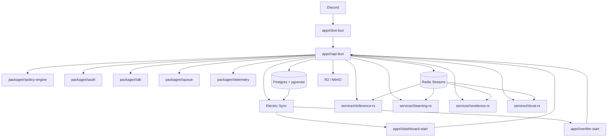
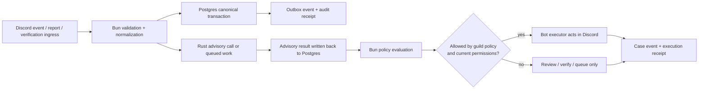
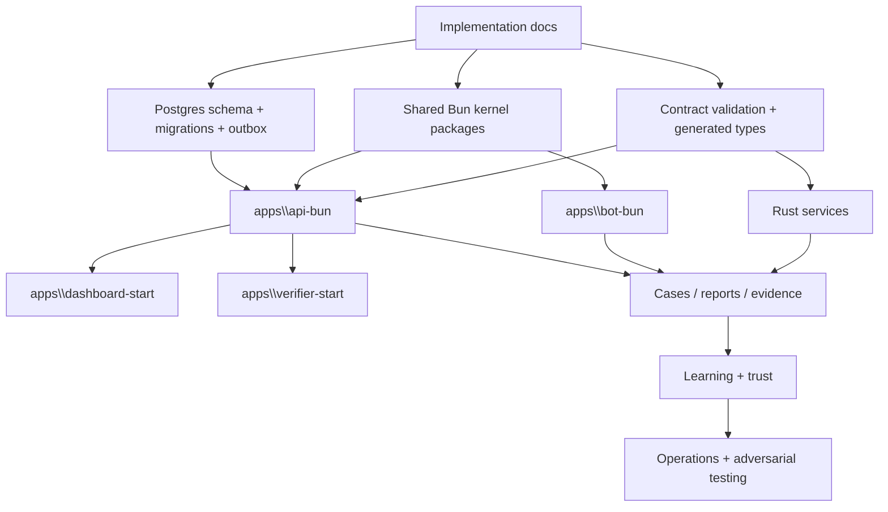

# Humanify architecture

Purpose: turn the product plan into implementation-facing runtime, module, data-flow, and ownership boundaries for the Bun-authoritative / Rust-advisory Humanify platform.

Governing docs:
- `AGENTS.md`
- `Implementation Plan.txt`
- `docs\README.md`
- `docs\reference-baseline.md`
- `docs\contracts.md`
- `docs\data-platform.md`
- `docs\observability-security.md`
- `docs\workspaces.md`
- `docs\architecture.md`

Upstream docs:
- Bun workspaces: https://bun.sh/docs/install/workspaces
- discord.js: https://discord.js.org/docs/packages/discord.js/main
- Elysia: https://elysiajs.com/at-glance
- TanStack Start React overview: https://tanstack.com/start/latest/docs/framework/react/overview
- Didit JavaScript SDK: https://docs.didit.me/integration/web-sdks/javascript-sdk
- Didit API full flow: https://docs.didit.me/integration/api-full-flow
- Didit webhooks: https://docs.didit.me/integration/webhooks
- Privado verifier overview: https://docs.privado.id/docs/verifier/verifier-overview/
- Privado request API: https://docs.privado.id/docs/verifier/verification-library/request-api/
- Privado verification API: https://docs.privado.id/docs/verifier/verification-library/verification-api/
- Privado verifier backend: https://docs.privado.id/docs/verifier/verifier-backend/
- W3C VC Data Model: https://www.w3.org/TR/vc-data-model/
- Electric Postgres Sync: https://electric-sql.com/docs/intro
- PostgreSQL: https://www.postgresql.org/docs/current/index.html
- Redis Streams: https://redis.io/docs/latest/develop/data-types/streams/
- Cloudflare R2: https://developers.cloudflare.com/r2/
- Axum: https://docs.rs/axum/latest/axum/
- OpenTelemetry context propagation: https://opentelemetry.io/docs/concepts/context-propagation/

This document converts the product-level architecture in `Implementation Plan.txt` into subsystem ownership that later code, migrations, packages, and services must follow.

## 1. Non-negotiable architecture rules

1. **Bun is authoritative for product workflows.** Auth, guild policy, moderation approval, verification session orchestration, audit generation, and Discord action approval live on the Bun side.
2. **Rust is advisory and computational.** Rust services classify, hash, embed, rerank, normalize, and learn, but they do not authorize moderation actions.
3. **Postgres is canonical.** Durable moderation, verification, case, audit, and learned-signal state is written to Postgres first.
4. **Redis Streams transports work; it does not own truth.** Queue delivery proves work is pending, not that business state is committed.
5. **Electric exposes read models only.** Dashboard and verifier clients read Postgres-backed views; they do not define canonical state.
6. **R2 stores bytes only.** Blob identity, retention, redaction, and access decisions stay in Postgres.
7. **SQLite/libSQL is disposable acceleration.** Local prediction and similarity caches may be rebuilt from canonical Postgres-backed events.
8. **Verification stays role-based and generic.** Capture provider, reusable proof backend, and policy consumer remain separate strategy roles so Bun orchestration stays reusable instead of provider-baked.
9. **Verification persistence is minimal-custody only.** Humanify stores proof receipts, attestation references, nullifiers or replay guards, and audit evidence; raw identity documents, full reusable credentials, and direct Didit full-session imports are out of bounds.

## 2. Runtime topology

### 2.1 Verification platform roles

Humanify's verification architecture stays generic by separating three roles:

| Role | Default / primary implementation | Humanify responsibility |
| --- | --- | --- |
| Capture provider | Didit for default first-time capture | create session intent, verify callback, normalize result, and immediately reduce persistence to minimal receipts/refs |
| Reusable proof backend | Privado as the primary reusable-ID / reusable-proof verifier backend | issue proof requests, verify returned proofs server-side, and store only minimal reusable-proof receipts/attestation refs |
| Policy consumer | Bun verification + policy flow | decide whether guild policy is satisfied and whether release/quarantine changes are allowed |

This keeps provider behavior behind role-based strategies while making it explicit that Humanify is not itself the reusable-ID store.

## 3. Ownership matrix

| Area | Primary owner | Secondary dependencies | What belongs here |
| --- | --- | --- | --- |
| Discord ingress and moderation execution | `apps\bot-bun` + `packages\discord-core` | `apps\api-bun`, `packages\policy-engine` | slash/context commands, event normalization, permission-aware action execution |
| HTTP product boundary | `apps\api-bun` | shared Bun packages, Rust services | auth/session routes, guild config, case/report APIs, verification routes, capture callbacks, proof verification handoffs, action approval |
| Moderator UI | `apps\dashboard-start` | Electric, TanStack DB, HeroUI | overview, risk-queue/case boundary visibility, verification state, action-policy boundary visibility, later live queue/cases/audit views |
| Verifier UI | `apps\verifier-start` | API, Electric, shared UI/auth | Discord-bound verification session UX and release results |
| Verification strategy layer | `packages\verification-providers` | `apps\api-bun`, `packages\auth`, `packages\policy-engine` | role-based verification strategy manifests, capture-provider adapters, reusable-proof backend adapters, and policy-consumer-compatible normalization |
| Shared product kernel | `packages\policy-engine`, `packages\db`, `packages\queue`, `packages\auth`, `packages\telemetry`, `packages\config`, `packages\contracts`, `packages\ui` | Postgres, Redis Streams, OpenTelemetry | reusable policy, persistence, queue, auth, validation, telemetry, and UI primitives |
| Advisory intelligence | `services\inference-rs`, `services\learning-rs`, `services\evidence-rs`, `services\trust-rs` | `crates\humanify-*`, Postgres, Redis Streams | scoring, similarity, embeddings, evidence transforms, learning updates, trust calculations |
| Canonical state | Postgres + `pgvector` | Electric, Rust and Bun services | guilds, members, verification sessions, minimal proof receipts/attestation refs/nullifiers, cases, reports, evidence metadata, outcomes, audit, outbox, receipts |
| Projection/cache state | Electric, SQLite/libSQL, optional Qdrant | Postgres | UI read models, local prediction caches, optional vector projection |

## 4. Canonical write and read paths

### 4.1 Write path

Implementation rule: every feature phase after documentation should be able to point to the exact Postgres transaction boundary, outbox write, and audit receipt creation point.

Verification-specific rule: verification ingress may include Didit capture callbacks or Privado proof verification results, but neither path may release a user or expand stored identity data without the Bun policy consumer and minimal-custody persistence rules above.

Current concrete repo anchor:

- `packages\db` now owns the Bun-first migration runner and canonical SQL files.
- `packages\db\migrations\0001_canonical_spine.sql` is the first exact transaction-layer implementation of the canonical tables described in `docs\data-platform.md`.
- `bun run db:migrate` is the required bootstrap step before app and worker code assumes the Postgres spine exists.

### 4.2 Read path

1. Postgres tables or Postgres-managed views define the read model.
2. Electric sync exposes the approved subset to dashboard and verifier clients.
3. TanStack DB mirrors those synced read models in the browser.
4. Browser state is optimistic at most; committed truth stays in Postgres.

## 5. Planned module boundaries

| Planned module | Bounded responsibility | Must not do |
| --- | --- | --- |
| `packages\policy-engine` | score-to-action mapping, verification requirement thresholds, action clamps | call Discord directly or read raw verification payloads |
| `packages\discord-core` | gateway intent bundles, permission checks, custom ID helpers, audit-reason formatting | bypass API policy approval |
| `packages\db` | repositories, migrations, transaction helpers, idempotency/outbox helpers | invent alternate business state outside Postgres |
| `packages\queue` | Redis Streams envelopes, trace propagation, producer/consumer helpers | claim queue delivery equals business completion |
| `packages\telemetry` | traceparent propagation, header redaction, structured log context, bootstrap boundaries | become the durable audit system |
| `packages\auth` | Discord OAuth2 helpers, session state, CSRF/state, verifier session helpers | approve moderation actions |
| `packages\config` | environment schema, role-specific loaders, safe config summaries | hide missing critical config behind silent defaults |
| `packages\verification-providers` | role-based verification strategies, provider manifests, minimal result normalization, and reusable-proof/capture adapter boundaries | bake provider-specific branching into apps or import full provider sessions into Humanify |
| `services\inference-rs` | advisory score/classify endpoints, fastembed text embeddings, similarity, rerank, explicit image-capability status | emit executable moderation commands |
| `services\learning-rs` | outcome ingestion, calibration, suppression, reputation updates | rewrite canonical moderator outcomes |
| `services\evidence-rs` | hashing, normalization, derivative generation, OCR prep, redaction primitives | own final retention or access policy |
| `services\trust-rs` | trust-network scoring, cross-server weighting, advisory summaries | become a global blacklist authority |

### 5.1 Initial shared Bun kernel API bundle

The first implementation-facing kernel package surfaces should stay boring and reusable:

| Package | Initial reusable surface |
| --- | --- |
| `packages\config` | environment loaders for service identity, API binding, Discord OAuth, session config, and policy clamp defaults |
| `packages\policy-engine` | score ladder mapping, verification requirement checks, policy clamps, Discord capability clamps |
| `packages\discord-core` | gateway intent bundles, custom ID helpers, audit-reason formatting, execution capability resolution |
| `packages\db` | Postgres connection parsing/redaction, idempotency receipts, canonical write plans, outbox event metadata |
| `packages\queue` | Redis Streams envelope serialization, canonical refs, propagated `traceparent`, recovery-plan helpers |
| `packages\telemetry` | trace context creation/parsing, traceparent injection, header redaction, structured log field builders |
| `packages\auth` | Discord authorize URL building, signed OAuth state tokens, verifier challenge tokens, session cookie helpers |
| `packages\verification-providers` | capture-provider and reusable-proof strategy manifests, normalized claim predicates, minimal receipt mapping, and policy-consumer-compatible strategy selection |

## 6. Subsystem dependency flow

The docs created in this phase unlock the next dependencies in order: canonical persistence, shared Bun kernel packages, then real API and bot flows.

## 7. Invariants later work must preserve

1. No Rust response, stream message, or dashboard mutation may directly execute a Discord moderation action.
2. Every mutating product flow must be attributable to an actor, a request, or an internal service identity.
3. Every cross-service boundary must preserve trace context and idempotency keys.
4. Dashboard and verifier UIs consume read models; they do not derive hidden business rules client-side.
5. Queue consumers must be replay-safe and re-check canonical state before destructive work.
6. Verification providers, trust-network feeds, and evidence transforms remain replaceable adapters behind Bun-owned orchestration.
7. Humanify must not become the long-term store for raw identity material, reusable credential bodies, or Didit full-session imports.

## 8. Dashboard MVP information architecture

The first real moderator dashboard in `apps\dashboard-start` now uses four operator routes:

- `/` for overview and system-state visibility
- `/cases` for honest risk-queue and case-read boundary visibility
- `/verification` for verification lifecycle and release-gate visibility
- `/policy` for action ladder and Bun-side policy clamp visibility

These routes are intentionally read-honest. They may show `pending_postgres_projection`, `dependency_unavailable`, `env_default_policy`, or other explicit boundary states, but they must not fabricate live case rows, moderation history, or verification outcomes before Postgres-backed read models and Electric sync exist.

Current trust/anomaly concrete boundary:

- `POST /guilds/:guildId/reports` now refreshes canonical per-subject anomaly summaries in `reputation_views`
- `POST /guilds/:guildId/cases/:caseId/review` now refreshes canonical per-reporter reputation summaries in `reputation_views`
- `GET /guilds/:guildId/risk-queue` may read those Postgres-backed summaries directly, but they remain advisory inputs for moderator review rather than direct enforcement authority

## 9. What follow-on work depends on this doc

- `define-shared-contracts` must keep the Bun ↔ Rust boundary aligned with the ownership matrix above.
- `wire-observability-security` must attach traces, audit, and redaction to the canonical write path, not as sidecars.
- schema/migration work must map entity families in `docs\data-platform.md` onto the write path defined here.
- API, bot, verification, cases, learning, operations, and testing work must treat this doc as the nearest runtime-boundary reference.
