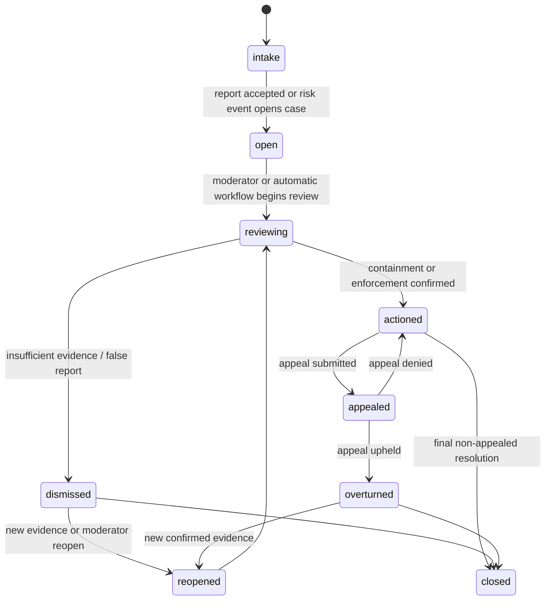
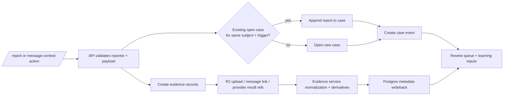

# Humanify cases, reports, and evidence

Purpose: define the implementation-facing lifecycle for reports, evidence, cases, moderator review, appeals, and evidence-derived workflow state.

Governing docs:
- `AGENTS.md`
- `Implementation Plan.txt`
- `docs\README.md`
- `docs\reference-baseline.md`
- `docs\contracts.md`
- `docs\data-platform.md`
- `docs\observability-security.md`
- `docs\architecture.md`
- `docs\api.md`
- `docs\discord-bot.md`
- `docs\cases-and-reports.md`

Upstream docs:
- discord.js: https://discord.js.org/docs/packages/discord.js/main
- Discord developer docs: https://discord.com/developers/docs/intro
- PostgreSQL: https://www.postgresql.org/docs/current/index.html
- Cloudflare R2: https://developers.cloudflare.com/r2/
- Cloudflare R2 presigned URLs: https://developers.cloudflare.com/r2/api/s3/presigned-urls/
- Redis Streams: https://redis.io/docs/latest/develop/data-types/streams/

## 1. Scope

This subsystem covers:

1. user and moderator report intake
2. message-link, attachment, screenshot, and provider-result evidence capture
3. case creation, deduplication, review, actioning, dismissal, and appeal
4. evidence metadata, blob hashing, derivative generation, and redaction requests
5. reporter-abuse defenses and trust weighting
6. auditability for every visible moderation step

`cases` are the durable review objects. `reports` are intake records that may open, enrich, or merge into cases.

## 2. Entity relationships

| Entity | Purpose | Notes |
| --- | --- | --- |
| `reports` | intake from slash commands, message context actions, API forms, or internal detectors | may map to existing or new cases |
| `cases` | canonical moderation review object | survives beyond any one report |
| `case_events` | append-only timeline of intake, evidence, scoring, review, action, appeal, and reopen events | primary explainability spine |
| `evidence_records` | canonical evidence item metadata | points to blobs, message links, or mod notes |
| `blob_objects` / `blob_derivatives` | blob identity plus redacted or transformed outputs | R2 stores bytes; Postgres stores identity |
| `case_outcomes` | moderator-confirmed result for learning and audit | feeds `docs\learning.md` |
| `appeals` | appeal review state and final disposition | must never silently overwrite original history |

## 3. Case lifecycle

Implementation rule: status is the summary; the real source of truth is the append-only `case_events` timeline.

## 4. Report and evidence flow

## 5. Intake surfaces

| Intake surface | Expected behavior | Anti-abuse requirement |
| --- | --- | --- |
| Slash `/report` | explicit reason, optional notes, optional attachment | rate limit by reporter and guild |
| Message context `Report message to Humanify` | attach canonical Discord message URL and message metadata | dedupe repeated reports on same message |
| Moderator case tools | open/reopen/attach evidence to cases | require guild authorization |
| Automated detector -> report bridge | allow risk events or provider callbacks to open cases | dedupe on trigger fingerprint |
| Appeal submission | bind to case and subject identity | require authenticated subject or moderator route |

## 6. Evidence handling rules

1. Evidence items are immutable references. Corrections create new derivatives or new case events; they do not silently rewrite prior evidence identity.
2. Blob objects are content-addressed or hash-prefixed and recorded with `sha256` and `blake3` where applicable.
3. Moderator views should prefer redacted derivatives when raw evidence is unnecessary.
4. Message links, hashes, timestamps, and actor IDs are the minimum durable integrity trail.
5. Evidence access, export, redaction, legal hold, and deletion decisions are auditable events.

## 7. Report-abuse defenses

| Abuse mode | Required defense |
| --- | --- |
| false-report spam | reporter reputation, reason requirement, cooldowns |
| brigading | dedupe by subject + trigger, weight by unique trusted reporters, timing anomaly detection |
| malicious moderator action | audit trail and optional dual-review for high-impact shared signals |
| evidence tampering | immutable hashes, message links, append-only timeline |
| cross-server abuse | opt-in trust sharing only, never automatic global punishment |

Reporter identity may be hidden from the accused in UI, but never from canonical audit records.

## 8. What later work depends on this doc

- API route implementation for reports, evidence, case review, appeals, and moderation notes
- Discord bot commands and context-menu handlers that create or enrich cases
- `services\evidence-rs` expansion into normalization, derivative generation, URL/domain extraction, and redaction primitives
- learning ingestion from `case_outcomes` and appeal results
