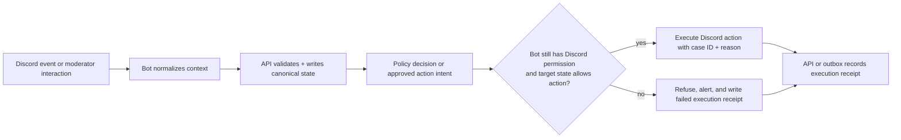

# Humanify Discord bot

Purpose: define the implementation-facing responsibilities, event intake rules, command inventory, and execution safeguards for `apps\bot-bun` and the planned `packages\discord-core` helpers.

Governing docs:
- `AGENTS.md`
- `Implementation Plan.txt`
- `docs\README.md`
- `docs\reference-baseline.md`
- `docs\contracts.md`
- `docs\observability-security.md`
- `docs\architecture.md`
- `docs\api.md`
- `docs\cases-and-reports.md`
- `docs\discord-bot.md`

Upstream docs:
- discord.js: https://discord.js.org/docs/packages/discord.js/main
- Discord developer docs: https://discord.com/developers/docs/intro
- Discord OAuth2: https://discord.com/developers/docs/topics/oauth2
- Bun workspaces: https://bun.sh/docs/install/workspaces
- Bun environment variables: https://bun.sh/docs/runtime/env
- OpenTelemetry JS propagation: https://opentelemetry.io/docs/languages/js/propagation/

## 1. Bot role

The bot is Humanify's Discord-native runtime. It owns:

1. slash and context-menu commands
2. Discord event intake and normalization
3. invite-tracking snapshots and guild capability discovery
4. moderator-facing alerts and review shortcuts
5. execution of already-approved moderation actions
6. ephemeral verification challenge delivery inside Discord

The bot does **not** own final policy decisions. It submits normalized events to the API, receives approved action intents, and then re-checks Discord capability before execution.

## 2. Command and interaction surface

| Command or action | Purpose | Backend dependency |
| --- | --- | --- |
| `/humanify setup` | initial guild setup, channel/role selection, capability checks | API guild-config routes |
| `/report user:@member ...` | open a report or append to a case | cases/reports routes |
| `/case open user:@member` | manual case creation | cases routes |
| `/quarantine user:@member` | moderator-requested containment | moderation approval + executor |
| `/approve user:@member` | release or confirm legitimacy | moderation/case routes |
| `/appeal case:<id>` | create or reopen an appeal | cases routes |
| message context `Report message to Humanify` | attach canonical Discord message URL and message metadata | report + evidence routes |
| message context `Attach to existing case` | append evidence without opening duplicate cases | cases/evidence routes |
| button/select shortcuts in alerts | confirm scam, confirm hacked account, dismiss, escalate | review/outcome routes |

All interaction handlers should be thin orchestration layers around `packages\discord-core` and API calls.

## 3. Event intake inventory

| Event family | What the bot captures | What happens next |
| --- | --- | --- |
| `guildMemberAdd` / membership changes | account age, join timing, invite source snapshot, guild policy context | normalize and send to API for scoring and case creation decisions |
| `messageCreate` / moderation-relevant content | message link, normalized domains, mention burst, attachment refs, duplicate pattern signals | store canonical refs, queue evidence/scoring work |
| invite changes | inviter, uses, age, spikes | update invite reputation context in API/Postgres |
| interaction events | slash commands, context commands, component actions | validate actor context, call API, show authoritative result |
| approved action intents | execution target, case ID, reason codes, approved action | re-check permission and perform Discord side effect with audit reason |

The bot should avoid keeping hidden business state. Local caches may exist for invite comparison or rate limiting, but canonical outcomes belong in Postgres.

## 4. Execution safety flow

Execution invariants:

1. the bot never executes a raw Rust recommendation
2. the bot never trusts stale permission assumptions from earlier API reads
3. every execution attempt includes case correlation and reason-code context
4. every failure path remains auditable

## 5. Required shared helpers

`packages\discord-core` should eventually own:

- command registration and versioning
- gateway intent bundles for invite tracking, moderation, and optional message-signal collection
- permission and capability inspection helpers
- normalized Discord event envelopes
- alert-message builders and interactive component IDs
- audit-log reason formatting (`case:<id>`, action, reason codes, request correlation)
- capability-aware wrappers around `kick`, `ban`, `timeout`, role changes, and verification-role release

`apps\bot-bun` should remain the runtime shell that wires the Discord client, config, telemetry, and API transport.

## 6. Permissions and capability expectations

| Capability | Discord-side need | Bot rule |
| --- | --- | --- |
| alert publishing | send messages, embed links | fail setup loudly if missing |
| quarantine | manage roles | do not attempt quarantine if target hierarchy blocks it |
| timeout | moderate members | only for actions already approved by API policy |
| kick | kick members | attach case and reason context |
| ban | ban members | off by default for automatic paths |
| verification role release | manage roles | only after verification session reaches a passed/released state |

Guild setup should persist the current capability snapshot so the API can clamp actions before they reach the executor.

## 7. Observability and audit requirements

The bot must emit:

- structured ingestion logs with `guildId`, `requestId`, `traceId`, and bounded subject identifiers
- execution-attempt metrics and permission-denial metrics
- spans for event handling, API calls, and Discord moderation actions
- durable audit receipts for approved actions, denied actions, verification-role releases, and moderator shortcut actions

Alert messages shown to moderators should prefer canonical case IDs and reason codes over free-form summaries that cannot be replayed.

## 8. Follow-on work that depends on this doc

- shared `packages\discord-core` work must keep bot logic reusable and thin
- real bot event ingestion should align with the route groups defined in `docs\api.md`
- verification challenge UX in Discord must stay aligned with `docs\verification.md`
- report, evidence, and appeal shortcuts must stay aligned with `docs\cases-and-reports.md`
