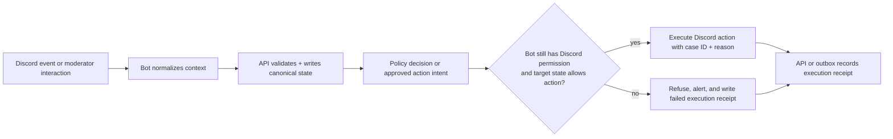

# Humanify Discord bot

Purpose: define the implementation-facing responsibilities, event intake rules, command inventory, and execution safeguards for `apps\bot-bun` and the planned `packages\discord-core` helpers.

Governing docs:
- `AGENTS.md`
- `Implementation Plan.txt`
- `docs\README.md`
- `docs\reference-baseline.md`
- `docs\contracts.md`
- `docs\observability-security.md`
- `docs\architecture.md`
- `docs\api.md`
- `docs\cases-and-reports.md`
- `docs\discord-bot.md`

Upstream docs:
- discord.js: https://discord.js.org/docs/packages/discord.js/main
- Discord developer docs: https://discord.com/developers/docs/intro
- Discord user flags: https://discord.com/developers/docs/resources/user#user-object-user-flags
- Discord OAuth2: https://discord.com/developers/docs/topics/oauth2
- Community Discord flag inventory: https://github.com/Delitefully/DiscordLists/blob/master/flags.md
- Bun workspaces: https://bun.sh/docs/install/workspaces
- Bun environment variables: https://bun.sh/docs/runtime/env
- OpenTelemetry JS propagation: https://opentelemetry.io/docs/languages/js/propagation/

## 1. Bot role

The bot is Humanify's Discord-native runtime. It owns:

1. slash and context-menu commands
2. Discord event intake and normalization
3. invite-tracking snapshots and guild capability discovery
4. moderator-facing alerts and review shortcuts
5. execution of already-approved moderation actions
6. ephemeral verification challenge delivery inside Discord

The bot does **not** own final policy decisions. It submits normalized events to the API, receives approved action intents, and then re-checks Discord capability before execution.

## 2. Command and interaction surface

| Command or action | Purpose | Backend dependency |
| --- | --- | --- |
| `/humanify setup` | initial guild setup, setup-mode selection, channel/role selection or automatic provisioning, capability checks | API guild-config routes |
| `/humanify panel [channel]` | post a reusable member-facing verification button into the current or chosen channel | API guild-config routes + verifier base URL |
| `/scan user:@member` | queue a durable single-member advisory score scan and warning refresh | scan routes + Temporal worker |
| `/scan-all` | queue a durable full-guild member scan | scan routes + Temporal worker |
| `/report user:@member ...` | open a report or append to a case | cases/reports routes |
| `/case open user:@member` | manual case creation | cases routes |
| `/quarantine user:@member` | moderator-requested containment | moderation approval + executor |
| `/approve user:@member` | release or confirm legitimacy | moderation/case routes |
| `/appeal case:<id>` | create or reopen an appeal | cases routes |
| message context `Report message to Humanify` | attach canonical Discord message URL and message metadata | report + evidence routes |
| message context `Attach to existing case` | append evidence without opening duplicate cases | cases/evidence routes |
| button/select shortcuts in alerts | confirm scam, confirm hacked account, dismiss, escalate | review/outcome routes |

All interaction handlers should be thin orchestration layers around `packages\discord-core` and API calls.

### 2.1 Current first implemented slice

The current bot spine makes the first real moderation intake surface concrete:

| Surface | Current behavior | Safety posture |
| --- | --- | --- |
| `/humanify setup` | server-admin guided setup flow for setup mode, channel/role choices, verification-path, proof-bundle, and face-check choices without leaving Discord | admin-only at command registration and runtime; reads current guild config from the API, keeps the language plain, saves only through the real guild-config routes, and can provision a Humanify-managed verification channel/panel/release-role set when the admin chooses automatic setup |
| `/humanify panel [channel]` | posts a reusable `Verify with Humanify` button for members | admin-only at command registration and runtime; button clicks create a real verification session for the clicking member and return the signed verifier link ephemerally |
| `/scan user:@member` | queues one canonical `single_member` scan request | admin-only at command registration so ordinary members do not see it by default; runtime still enforces the trusted-moderator rule if an admin later widens command access in Discord, and the Temporal worker later posts a moderator-visible completion summary even when no suspicious case is opened |
| `/scan-all` | queues one canonical `all_members` scan request | admin-only at command registration and runtime; the reply stays explicit that Humanify has only queued the durable workflow so far, and the worker later posts the final summary to the configured moderation surface |
| `/report user reason [notes]` | opens a report via the API and plans a case when one does not already exist | admin-scoped at command registration so ordinary members do not see it by default; runtime still answers honestly about the current persistence boundary and any follow-up verification shortcut |
| `/case open user reason [notes]` | opens a manual case via the report intake route | admin-scoped at command registration so ordinary members do not see it by default; if a guild admin later widens the command in Discord, Humanify still keeps the trusted-moderator runtime gate and never executes moderation directly from the command response |
| `/verify user [capability]` | creates a verification session tied to the Discord member | admin-scoped at command registration so ordinary members do not see it by default; if a guild admin later widens the command in Discord, self-verification still works for the actor's own account while cross-user starts keep the trusted-moderator gate, DM the target user with the verifier link, explain why verification is required, and apply any configured containment roles before the final release |
| message context `Report message to Humanify` | opens a report and then attaches canonical Discord message metadata (`messageId`, `channelId`, message URL, preview) as evidence | evidence is queued as planned canonical write work, not synthetic success |
| button `Start verification` | creates a verification session bound to the case/user pair encoded in the shared Humanify custom ID | self-verification stays available, cross-user starts require a trusted moderator, and moderator-triggered starts now DM the target user, apply configured containment roles, and return the signed verifier URL plus the linked warning-card follow-up note |

Current moderator/admin message presentation:

1. Humanify now renders moderator/admin replies, setup steps, verification panels, warning cards, and durable scan summaries as **Discord Components v2** cards instead of flat `content` strings.
2. The current card contract uses **containers, text displays, separators, and retained action rows** so moderators get the state snapshot first and the next action in the same message.
3. Warning cards now keep a built-in `Start verification` action so moderators can move directly from advisory review into verification without hunting for a separate command.

## 3. Event intake inventory

| Event family | What the bot captures | What happens next |
| --- | --- | --- |
| `guildMemberAdd` / membership changes | account age, join timing, invite source snapshot, guild policy context | normalize and send to API for scoring and case creation decisions |
| `messageCreate` / moderation-relevant content | message link, normalized domains, mention burst, attachment refs, duplicate pattern signals | store canonical refs, queue evidence/scoring work |
| invite changes | inviter, uses, age, spikes | update invite reputation context in API/Postgres |
| interaction events | slash commands, context commands, component actions | validate actor context, call API, show authoritative result |
| approved action intents | execution target, case ID, reason codes, approved action | re-check permission and perform Discord side effect with audit reason |

The bot should avoid keeping hidden business state. Local caches may exist for invite comparison or rate limiting, but canonical outcomes belong in Postgres.

Current passive detector bridge implementation:

1. `guildMemberAdd` now runs the shared weighted member scorer and opens an advisory detector-bridge report once the account reaches the current `watch` threshold (`4/10`), including combinations like a very new account, a young incomplete-profile account, or a sparse missing-avatar profile with the synthetic test-handle pattern.
2. `messageCreate` now opens an advisory detector-bridge report when message-signal collection is enabled and the message matches one of the current stable reason codes:
   - `first_message_link`
   - `mention_burst`
   - `duplicate_message_pattern`
3. Passive message reports also attach canonical Discord `message_link` evidence so moderator warnings can show the same bounded preview and message reference that manual message-context reporting uses.
4. Passive event ingestion remains advisory-only: it opens or enriches canonical cases and updates moderator warnings, but it does not authorize automatic moderation.

### 3.1 Passive detector configuration

Two runtime flags now control passive Discord ingestion:

| Env var | Default | Purpose |
| --- | --- | --- |
| `HUMANIFY_BOT_ENABLE_MEMBER_JOIN_SIGNALS` | `true` | enables advisory `guildMemberAdd` detector-bridge reports for suspicious new-account joins |
| `HUMANIFY_BOT_ENABLE_MESSAGE_SIGNALS` | `false` | enables `messageCreate` detector-bridge reporting and requests the Discord message-content intents needed for first-message-link / mention-burst / duplicate-pattern detection |

`HUMANIFY_BOT_ENABLE_MESSAGE_SIGNALS=true` must only be enabled when the Discord application is approved for the message-content intent and the server owner wants passive content-based bot catching turned on.

### 3.2 Discord account-flag normalization and scoring map

The current shipped member scan still uses the shared base profile/account signals from `packages\discord-core`. The expanded Discord-flag map below is the governing scoring plan for any future flag-aware enrichment so the detector does not treat badges, system accounts, or platform-abuse states as ad hoc one-offs.

Scoring rules:

1. start from the existing shared member-scan base score (`account_age_*`, `profile_*`)
2. apply the account, premium, and guild-member flag deltas below
3. clamp the final score to the shared advisory range `0..10`
4. open or refresh the advisory case at the current `watch` threshold (`4/10`)
5. treat non-human/service classifications separately from human-risk scoring

Guardrails:

- public/documented `public_flags` are the normal bot-side source of truth today
- undocumented/private flags from trusted enrichment sources are advisory unless they describe an explicit Discord abuse or disabled-account state
- trust-positive cosmetic or premium signals must never erase an already-strong abuse signal
- `USED_*_CLIENT` flags may subtract at most **2 total**
- purchased-premium flags may subtract at most **2 total**
- premium-usage flags may subtract at most **1 total**
- HypeSquad family flags may subtract at most **1 total**
- trust-positive reductions are capped at **-4 total** unless the account carries an official high-trust flag (`STAFF`, `PARTNER`, collaborator, or `CERTIFIED_MODERATOR`)

#### 3.2.1 Base shared score inputs

| Reason code | Meaning | Points |
| --- | --- | ---: |
| `account_age_lt_24h` | Discord account younger than 24 hours | +6 |
| `account_age_lt_7d` | Discord account younger than 7 days | +3 |
| `profile_missing_avatar` | no avatar set | +2 |
| `profile_test_handle_pattern` | sparse missing-avatar profile also looks like a synthetic test handle | +2 |

#### 3.2.2 User-account flags

| Discord flag | Meaning | Detector treatment | Points |
| --- | --- | --- | ---: |
| `STAFF` | Discord employee | official high-trust override | -6 |
| `PARTNER` | Partnered Server Owner | official high-trust override | -5 |
| `HYPESQUAD` | HypeSquad Events member | weak trust-positive badge | -1 |
| `BUG_HUNTER_LEVEL_1` | Bug Hunter Level 1 | medium trust-positive badge | -2 |
| `MFA_SMS` | SMS recovery enabled for 2FA | telemetry only; not enough to trust | 0 |
| `PREMIUM_PROMO_DISMISSED` | dismissed Nitro promotion | telemetry only | 0 |
| `HYPESQUAD_ONLINE_HOUSE_1` | House Bravery | weak trust-positive badge | -1 |
| `HYPESQUAD_ONLINE_HOUSE_2` | House Brilliance | weak trust-positive badge | -1 |
| `HYPESQUAD_ONLINE_HOUSE_3` | House Balance | weak trust-positive badge | -1 |
| `PREMIUM_EARLY_SUPPORTER` | Early Supporter | medium trust-positive account-age proxy | -2 |
| `TEAM_USER` | team pseudo-user | classify as service/team account; do not human-score | special |
| `INTERNAL_APPLICATION` | internal application-related account state | classify as internal/service if surfaced; do not human-score | special |
| `SYSTEM` | official Discord system user | exempt from human-risk scoring | special |
| `HAS_UNREAD_URGENT_MESSAGES` | unread urgent system message | telemetry only | 0 |
| `BUG_HUNTER_LEVEL_2` | Bug Hunter Level 2 | strong trust-positive badge | -3 |
| `UNDERAGE_DELETED` | pending deletion for underage DOB flow | high-risk invalid-account state; floor score to 8 and require manual review | floor 8 |
| `VERIFIED_BOT` | verified bot account | classify as bot/service; do not human-score | special |
| `VERIFIED_DEVELOPER` | early verified bot developer | medium trust-positive builder signal | -2 |
| `CERTIFIED_MODERATOR` | Moderator Programs Alumni | official moderator-trust signal | -4 |
| `BOT_HTTP_INTERACTIONS` | bot with interactions endpoint | classify as bot/service when the subject is a bot; otherwise telemetry only | special |
| `SPAMMER` | Discord marked the account as spammer | hard abuse override; immediate advisory case | override 10 |
| `DISABLE_PREMIUM` | Nitro features disabled | telemetry only | 0 |
| `ACTIVE_DEVELOPER` | active developer | strong trust-positive builder signal | -3 |
| `HIGH_GLOBAL_RATE_LIMIT` | high global rate limit | slight risk-positive signal if surfaced by trusted enrichment; never sole trigger | +1 |
| `DELETED` | account deleted | invalid subject; skip human scoring and refresh canonical identity state | special |
| `DISABLED_SUSPICIOUS_ACTIVITY` | disabled for suspicious activity | hard abuse override; immediate advisory case | override 10 |
| `SELF_DELETED` | account self-deleted | invalid subject; skip human scoring and refresh canonical identity state | special |
| `PREMIUM_DISCRIMINATOR` | premium discriminator history | weak trust-positive cosmetic signal | -1 |
| `USED_DESKTOP_CLIENT` | has used desktop client | weak trust-positive maturity signal | -1 |
| `USED_WEB_CLIENT` | has used web client | weak trust-positive maturity signal | -1 |
| `USED_MOBILE_CLIENT` | has used mobile client | weak trust-positive maturity signal | -1 |
| `DISABLED` | currently disabled | high-risk disabled-account state; floor score to 8 and require manual review | floor 8 |
| `VERIFIED_EMAIL` | verified email | medium trust-positive hygiene signal | -2 |
| `QUARANTINED` | account quarantined | hard abuse override; immediate advisory case | override 10 |
| `COLLABORATOR` | collaborator with staff permissions | official high-trust override | -5 |
| `RESTRICTED_COLLABORATOR` | restricted collaborator with staff permissions | official high-trust override | -4 |

#### 3.2.3 Purchased user flags

These should only lightly reduce score because payment is a weak legitimacy proxy and can be compromised.

| Purchased flag | Meaning | Detector treatment | Points |
| --- | --- | --- | ---: |
| `NITRO_CLASSIC` | user purchased Nitro Classic | weak trust-positive premium purchase | -1 |
| `NITRO` | user purchased Nitro | weak trust-positive premium purchase | -1 |
| `GUILD_BOOST` | user purchased a guild boost | weak trust-positive community investment signal | -1 |
| `NITRO_BASIC` | user purchased Nitro Basic | weak trust-positive premium purchase | -1 |

#### 3.2.4 Premium-usage user flags

These are cosmetic maturity hints only and should remain low-weight.

| Premium usage flag | Meaning | Detector treatment | Points |
| --- | --- | --- | ---: |
| `PREMIUM_DISCRIMINATOR` | used premium discriminator | weak trust-positive cosmetic signal | -1 |
| `ANIMATED_AVATAR` | used animated avatar | weak trust-positive cosmetic signal | -1 |
| `PROFILE_BANNER` | used profile banner | weak trust-positive cosmetic signal | -1 |

#### 3.2.5 Guild-member flags

These are guild-scoped context flags rather than account-global trust badges, so they should stay secondary to account/profile signals.

| Guild member flag | Meaning | Detector treatment | Points |
| --- | --- | --- | ---: |
| `DID_REJOIN` | member left and rejoined | slight risk-positive churn signal | +1 |
| `COMPLETED_ONBOARDING` | member completed onboarding | slight trust-positive guild maturity signal | -1 |
| `BYPASSES_VERIFICATION` | member bypasses guild verification requirements | policy/configuration signal only; never a trust bonus | 0 |
| `STARTED_ONBOARDING` | member started onboarding | telemetry only until combined with other behavior signals | 0 |

#### 3.2.6 Reason-code normalization rules

When Discord flags become first-class detector inputs, normalize them into stable reason codes instead of logging raw bitfields:

- account flags -> `flag_<signal>` (for example `flag_spammer`, `flag_active_developer`, `flag_verified_email`)
- guild-member flags -> `guild_member_<signal>` (for example `guild_member_did_rejoin`, `guild_member_completed_onboarding`)
- purchased or premium-usage flags -> still normalize under `flag_<signal>` because they are account-level enrichment, not message content

#### 3.2.7 Flag families that do **not** directly change user points

The community list also includes application, activity, channel, system-channel, thread-member, message, and SKU flags. Those are not part of the account-risk point map. If Humanify later consumes them, they should become:

- `message_*` reasons for message flags (for example a Discord link warning turning into a domain/message reason)
- `behavior_*` or `guild_member_*` reasons for guild-scoped state
- infrastructure or bot-capability checks for application flags

They should not be mixed into the human account trust score as if they were user badges.

Slash commands register globally by default, which is the multi-guild production shape. `HUMANIFY_BOT_COMMAND_GUILD_ID` exists only as an optional development override when you intentionally want faster command propagation in one Discord server; leaving it unset preserves the normal multi-guild global registration path.

## 4. Execution safety flow

Execution invariants:

1. the bot never executes a raw Rust recommendation
2. the bot never trusts stale permission assumptions from earlier API reads
3. every execution attempt includes case correlation and reason-code context
4. every failure path remains auditable

Current executor rule for the first slice: if the API returns only `planned_not_persisted` durability, the bot must stop at planning and tell the moderator that no Discord-side enforcement or role release happened yet. The bot may only move from planning to execution once Bun approval is durable and the current Discord capability check still passes.

## 5. Required shared helpers

`packages\discord-core` should eventually own:

- command registration and versioning
- gateway intent bundles for invite tracking, moderation, and optional message-signal collection
- permission and capability inspection helpers
- normalized Discord event envelopes
- alert-message builders and interactive component IDs
- audit-log reason formatting (`case:<id>`, action, reason codes, request correlation)
- capability-aware wrappers around `kick`, `ban`, `timeout`, role changes, and verification-role release

`apps\bot-bun` should remain the runtime shell that wires the Discord client, config, telemetry, and API transport.

## 6. Permissions and capability expectations

| Capability | Discord-side need | Bot rule |
| --- | --- | --- |
| alert publishing | send messages, embed links | fail setup loudly if missing |
| quarantine | manage roles | do not attempt quarantine if target hierarchy blocks it |
| timeout | moderate members | only for actions already approved by API policy |
| kick | kick members | attach case and reason context |
| ban | ban members | off by default for automatic paths |
| verification role release | manage roles | only after verification session reaches a passed/released state |

Guild setup should persist the current capability snapshot so the API can clamp actions before they reach the executor.
The setup/channel-config slice now also has canonical API reads and writes for:

- setup-mode persistence (`manual` vs `automatic`)
- current channel setup hydration via `GET /guilds/:guildId/channels`
- required `moderatorAlertChannelId`
- optional `reviewChannelId`
- optional `auditLogChannelId`
- optional `moderationLogChannelId`
- optional `verificationChannelId` and `verificationPanelMessageId`
- tracked `managedResources` so later bot passes know which Discord resources Humanify owns

Moderator warning, review flows, and `/humanify setup` should read those canonical channel IDs instead of relying on command-local state.

Moderator warning cards now have a canonical advisory read/update loop at the API boundary:

- `GET /guilds/:guildId/cases/:caseId/warning-card` returns the bounded card payload the bot should render or refresh: case summary, evidence summary, latest linked-or-subject verification summary, reusable-credential bridge status when present, face-check state when present, and the persisted Discord alert-message ref when one exists
- `PUT /guilds/:guildId/cases/:caseId/warning-card/alert-message` persists the current Discord message pointer for that case so later bot passes can edit the existing warning card instead of reposting a duplicate

These warning cards remain advisory-only. Persisting or reading a warning card does not authorize moderation or invent enforcement state.

The current bot runtime now wires that advisory loop into the realistic touchpoints it already owns:

- after `/report` and `/case open` create or reuse a case
- after message-context reporting attaches canonical Discord message-link evidence
- after the case-linked `Start verification` shortcut creates or refreshes a verification session

At each touchpoint the bot reads the latest warning-card model, prefers editing the persisted Discord alert message when the canonical ref still points at the configured moderator alert channel, and otherwise posts a fresh advisory **Components v2** message and persists its new ref through the API. If the canonical alert channel is missing or Discord delivery fails, the bot must say so plainly instead of implying moderation succeeded.

Authorization rules for the current command surface:

1. `/humanify setup` is server-admin-only.
2. `/humanify panel` is server-admin-only.
3. Trusted moderator actions must fail closed when the actor lacks current guild permissions or the runtime cannot read them.
4. `/report`, `/case open`, and `/verify` are admin-scoped at command registration so ordinary members do not see those slash entry points by default.
5. The shared trusted-moderator gate still covers `/case open` and starting verification for another member in case a guild admin later widens those command permissions inside Discord.
6. Member-facing verification entry points still exist through Discord buttons and other case-linked flows; when `/verify` is explicitly widened by a guild admin, self-verification continues to work for the actor's own account.
7. `/scan` is admin-scoped at command registration because Discord global command defaults can only express one required permission bitset; if a guild admin later widens the command in Discord, Humanify still enforces the trusted-moderator runtime gate.
8. `/scan-all` requires the server-admin gate at both command registration and runtime.

### 6.1 Durable member scans

The current bot runtime now exposes two operator-driven scan entrypoints:

1. `/scan user:@member` for a one-off advisory scan of a specific account
2. `/scan-all` for a full guild walk when the admin wants a durable backlog job

Both commands stay honest about the workflow boundary:

- the bot only creates the canonical scan request through the API
- `apps\scan-worker-temporal` later claims the request from Postgres, runs the Discord member walk through Temporal, opens any advisory reports, refreshes moderator warning cards, and posts a completion or failure summary into the configured moderation log / review / alert channel as a structured Components v2 card
- command responses never claim that the member walk has already completed when the request is only `pending` or `claimed`
- both commands are admin-scoped at registration time so non-admin members do not get scan entrypoints by default

### 6.2 Guided setup flow

`/humanify setup` now walks a server admin through these plain-language steps inside Discord:

1. choose `manual` or `automatic` setup mode
2. in manual mode, choose alert/review/audit/mod-log channels
3. in manual mode, choose trusted moderator roles and suspicious roles
4. in manual mode, choose post-verification role grants for `verified_human`, `18+`, and `21+`
5. choose enabled verification paths and the default path
6. choose required proof bundles
7. choose whether a face check is required
8. confirm and save through `PUT /guilds/:guildId/channels` plus `PUT /guilds/:guildId/verification`

The flow stays honest about unsaved progress: nothing is saved until the admin reaches the final confirm step and the API accepts the writes.

Automatic setup currently provisions and tracks this first owned-resource set:

1. a Humanify-managed text channel named `prove-youre-human`
2. the reusable `Verify with Humanify` panel message in that channel
3. `Verified Human`, `Quarantine`, `18+`, and `21+` roles

When automatic setup runs, Humanify persists those refs as owned `managedResources`, points the verification channel/panel fields at the created Discord objects, and maps the created roles back into `suspiciousRoleIds` plus the `verified_human` / `age_over_18` / `age_over_21` role grants. If the bot lacks `Manage Channels` or `Manage Roles`, or if a conflicting non-owned `prove-youre-human` channel already exists, setup fails loudly instead of silently guessing.

After setup, `/humanify panel` lets the admin post the reusable verification button into a member-facing channel. That button always creates a fresh guild-scoped verification session for the clicking member, and any configured verification role grants are only applied after the canonical verification session reaches `released`.

When a trusted moderator starts verification for another member through `/verify` or the warning-card shortcut, the bot must:

1. DM the target user with a Humanify card that explains verification was requested and includes the signed verifier link.
2. Apply the configured `suspiciousRoleIds` as containment roles immediately when the guild has them configured.
3. Tell the moderator plainly when DM delivery or role changes fail instead of pretending the containment start succeeded.
4. Leave self-started member verification flows non-containment by default; only the moderator-start path automatically contains the target member.

## 7. Observability and audit requirements

The bot must emit:

- structured ingestion logs with `guildId`, `requestId`, `traceId`, and bounded subject identifiers
- execution-attempt metrics and permission-denial metrics
- spans for event handling, API calls, and Discord moderation actions
- durable audit receipts for approved actions, denied actions, verification-role releases, and moderator shortcut actions

Current concrete first-slice wiring:

- each interaction now creates a request-correlation bundle that the bot forwards to the API as `x-request-id` plus W3C `traceparent`
- boot logs now publish which propagation headers the runtime is using and whether Bun-side Sentry egress is enabled
- boot logs now also publish whether member-join signals and message signals are enabled for the running bot instance
- message-context evidence intake stays constrained to canonical Discord message-link refs rather than arbitrary external URLs

Alert messages shown to moderators should prefer canonical case IDs and reason codes over free-form summaries that cannot be replayed.

## 8. Follow-on work that depends on this doc

- shared `packages\discord-core` work must keep bot logic reusable and thin
- real bot event ingestion should align with the route groups defined in `docs\api.md`
- verification challenge UX in Discord must stay aligned with `docs\verification.md`
- report, evidence, and appeal shortcuts must stay aligned with `docs\cases-and-reports.md`
