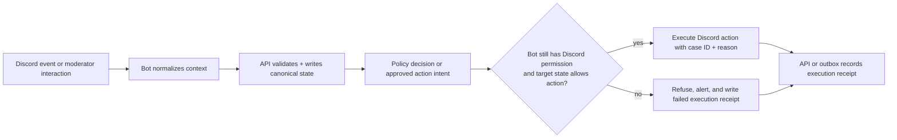

# Humanify Discord bot

Purpose: define the implementation-facing responsibilities, event intake rules, command inventory, and execution safeguards for `apps\bot-bun` and the planned `packages\discord-core` helpers.

Governing docs:
- `AGENTS.md`
- `Implementation Plan.txt`
- `docs\README.md`
- `docs\reference-baseline.md`
- `docs\contracts.md`
- `docs\observability-security.md`
- `docs\architecture.md`
- `docs\api.md`
- `docs\cases-and-reports.md`
- `docs\discord-bot.md`

Upstream docs:
- discord.js: https://discord.js.org/docs/packages/discord.js/main
- Discord developer docs: https://discord.com/developers/docs/intro
- Discord OAuth2: https://discord.com/developers/docs/topics/oauth2
- Bun workspaces: https://bun.sh/docs/install/workspaces
- Bun environment variables: https://bun.sh/docs/runtime/env
- OpenTelemetry JS propagation: https://opentelemetry.io/docs/languages/js/propagation/

## 1. Bot role

The bot is Humanify's Discord-native runtime. It owns:

1. slash and context-menu commands
2. Discord event intake and normalization
3. invite-tracking snapshots and guild capability discovery
4. moderator-facing alerts and review shortcuts
5. execution of already-approved moderation actions
6. ephemeral verification challenge delivery inside Discord

The bot does **not** own final policy decisions. It submits normalized events to the API, receives approved action intents, and then re-checks Discord capability before execution.

## 2. Command and interaction surface

| Command or action | Purpose | Backend dependency |
| --- | --- | --- |
| `/humanify setup` | initial guild setup, channel/role selection, capability checks | API guild-config routes |
| `/report user:@member ...` | open a report or append to a case | cases/reports routes |
| `/case open user:@member` | manual case creation | cases routes |
| `/quarantine user:@member` | moderator-requested containment | moderation approval + executor |
| `/approve user:@member` | release or confirm legitimacy | moderation/case routes |
| `/appeal case:<id>` | create or reopen an appeal | cases routes |
| message context `Report message to Humanify` | attach canonical Discord message URL and message metadata | report + evidence routes |
| message context `Attach to existing case` | append evidence without opening duplicate cases | cases/evidence routes |
| button/select shortcuts in alerts | confirm scam, confirm hacked account, dismiss, escalate | review/outcome routes |

All interaction handlers should be thin orchestration layers around `packages\discord-core` and API calls.

### 2.1 Current first implemented slice

The current bot spine makes the first real moderation intake surface concrete:

| Surface | Current behavior | Safety posture |
| --- | --- | --- |
| `/humanify setup` | server-admin guided setup flow for channel, role, verification-path, proof-bundle, and face-check choices without leaving Discord | admin-only at command registration and runtime; reads current guild config from the API, keeps the language plain, and only saves through the real guild-config routes |
| `/report user reason [notes]` | opens a report via the API and plans a case when one does not already exist | replies honestly that persistence is still pending and offers a verification shortcut only as additional intake |
| `/case open user reason [notes]` | opens a manual case via the report intake route | trusted-moderator-only at runtime; no moderation action is executed from the command response |
| `/verify user [capability]` | creates a verification session tied to the Discord member | self-verification stays available; verifying another member requires a trusted moderator and session creation is still reported as planned, not durably completed |
| message context `Report message to Humanify` | opens a report and then attaches canonical Discord message metadata (`messageId`, `channelId`, message URL, preview) as evidence | evidence is queued as planned canonical write work, not synthetic success |
| button `Start verification` | creates a verification session bound to the case/user pair encoded in the shared Humanify custom ID | self-verification stays available, cross-user starts require a trusted moderator, and button handlers reject mismatched guild context without implying release or enforcement |

## 3. Event intake inventory

| Event family | What the bot captures | What happens next |
| --- | --- | --- |
| `guildMemberAdd` / membership changes | account age, join timing, invite source snapshot, guild policy context | normalize and send to API for scoring and case creation decisions |
| `messageCreate` / moderation-relevant content | message link, normalized domains, mention burst, attachment refs, duplicate pattern signals | store canonical refs, queue evidence/scoring work |
| invite changes | inviter, uses, age, spikes | update invite reputation context in API/Postgres |
| interaction events | slash commands, context commands, component actions | validate actor context, call API, show authoritative result |
| approved action intents | execution target, case ID, reason codes, approved action | re-check permission and perform Discord side effect with audit reason |

The bot should avoid keeping hidden business state. Local caches may exist for invite comparison or rate limiting, but canonical outcomes belong in Postgres.

Current passive detector bridge implementation:

1. `guildMemberAdd` now opens an advisory detector-bridge report when the joining account is less than 24 hours old, or when it is less than 7 days old and still missing a profile avatar.
2. `messageCreate` now opens an advisory detector-bridge report when message-signal collection is enabled and the message matches one of the current stable reason codes:
   - `first_message_link`
   - `mention_burst`
   - `duplicate_message_pattern`
3. Passive message reports also attach canonical Discord `message_link` evidence so moderator warnings can show the same bounded preview and message reference that manual message-context reporting uses.
4. Passive event ingestion remains advisory-only: it opens or enriches canonical cases and updates moderator warnings, but it does not authorize automatic moderation.

### 3.1 Passive detector configuration

Two runtime flags now control passive Discord ingestion:

| Env var | Default | Purpose |
| --- | --- | --- |
| `HUMANIFY_BOT_ENABLE_MEMBER_JOIN_SIGNALS` | `true` | enables advisory `guildMemberAdd` detector-bridge reports for suspicious new-account joins |
| `HUMANIFY_BOT_ENABLE_MESSAGE_SIGNALS` | `false` | enables `messageCreate` detector-bridge reporting and requests the Discord message-content intents needed for first-message-link / mention-burst / duplicate-pattern detection |

`HUMANIFY_BOT_ENABLE_MESSAGE_SIGNALS=true` must only be enabled when the Discord application is approved for the message-content intent and the server owner wants passive content-based bot catching turned on.

## 4. Execution safety flow

Execution invariants:

1. the bot never executes a raw Rust recommendation
2. the bot never trusts stale permission assumptions from earlier API reads
3. every execution attempt includes case correlation and reason-code context
4. every failure path remains auditable

Current executor rule for the first slice: if the API returns only `planned_not_persisted` durability, the bot must stop at planning and tell the moderator that no Discord-side enforcement or role release happened yet. The bot may only move from planning to execution once Bun approval is durable and the current Discord capability check still passes.

## 5. Required shared helpers

`packages\discord-core` should eventually own:

- command registration and versioning
- gateway intent bundles for invite tracking, moderation, and optional message-signal collection
- permission and capability inspection helpers
- normalized Discord event envelopes
- alert-message builders and interactive component IDs
- audit-log reason formatting (`case:<id>`, action, reason codes, request correlation)
- capability-aware wrappers around `kick`, `ban`, `timeout`, role changes, and verification-role release

`apps\bot-bun` should remain the runtime shell that wires the Discord client, config, telemetry, and API transport.

## 6. Permissions and capability expectations

| Capability | Discord-side need | Bot rule |
| --- | --- | --- |
| alert publishing | send messages, embed links | fail setup loudly if missing |
| quarantine | manage roles | do not attempt quarantine if target hierarchy blocks it |
| timeout | moderate members | only for actions already approved by API policy |
| kick | kick members | attach case and reason context |
| ban | ban members | off by default for automatic paths |
| verification role release | manage roles | only after verification session reaches a passed/released state |

Guild setup should persist the current capability snapshot so the API can clamp actions before they reach the executor.
The setup/channel-config slice now also has canonical API reads and writes for:

- current channel setup hydration via `GET /guilds/:guildId/channels`
- required `moderatorAlertChannelId`
- optional `reviewChannelId`
- optional `auditLogChannelId`
- optional `moderationLogChannelId`

Moderator warning, review flows, and `/humanify setup` should read those canonical channel IDs instead of relying on command-local state.

Moderator warning cards now have a canonical advisory read/update loop at the API boundary:

- `GET /guilds/:guildId/cases/:caseId/warning-card` returns the bounded card payload the bot should render or refresh: case summary, evidence summary, latest linked-or-subject verification summary, reusable-credential bridge status when present, face-check state when present, and the persisted Discord alert-message ref when one exists
- `PUT /guilds/:guildId/cases/:caseId/warning-card/alert-message` persists the current Discord message pointer for that case so later bot passes can edit the existing warning card instead of reposting a duplicate

These warning cards remain advisory-only. Persisting or reading a warning card does not authorize moderation or invent enforcement state.

The current bot runtime now wires that advisory loop into the realistic touchpoints it already owns:

- after `/report` and `/case open` create or reuse a case
- after message-context reporting attaches canonical Discord message-link evidence
- after the case-linked `Start verification` shortcut creates or refreshes a verification session

At each touchpoint the bot reads the latest warning-card model, prefers editing the persisted Discord alert message when the canonical ref still points at the configured moderator alert channel, and otherwise posts a fresh advisory message and persists its new ref through the API. If the canonical alert channel is missing or Discord delivery fails, the bot must say so plainly instead of implying moderation succeeded.

Authorization rules for the current command surface:

1. `/humanify setup` is server-admin-only.
2. Trusted moderator actions must fail closed when the actor lacks current guild permissions or the runtime cannot read them.
3. The shared trusted-moderator gate covers the current moderation-oriented entry points (`/case open` and starting verification for another member).
4. Member-facing verification entry points must remain available for the actor's own account.

### 6.1 Guided setup flow

`/humanify setup` now walks a server admin through these plain-language steps inside Discord:

1. choose alert/review/audit/mod-log channels
2. choose trusted moderator roles and suspicious roles
3. choose enabled verification paths and the default path
4. choose required proof bundles
5. choose whether a face check is required
6. confirm and save through `PUT /guilds/:guildId/channels` plus `PUT /guilds/:guildId/verification`

The flow stays honest about unsaved progress: nothing is saved until the admin reaches the final confirm step and the API accepts the writes.

## 7. Observability and audit requirements

The bot must emit:

- structured ingestion logs with `guildId`, `requestId`, `traceId`, and bounded subject identifiers
- execution-attempt metrics and permission-denial metrics
- spans for event handling, API calls, and Discord moderation actions
- durable audit receipts for approved actions, denied actions, verification-role releases, and moderator shortcut actions

Current concrete first-slice wiring:

- each interaction now creates a request-correlation bundle that the bot forwards to the API as `x-request-id` plus W3C `traceparent`
- boot logs now publish which propagation headers the runtime is using and whether Bun-side Sentry egress is enabled
- boot logs now also publish whether member-join signals and message signals are enabled for the running bot instance
- message-context evidence intake stays constrained to canonical Discord message-link refs rather than arbitrary external URLs

Alert messages shown to moderators should prefer canonical case IDs and reason codes over free-form summaries that cannot be replayed.

## 8. Follow-on work that depends on this doc

- shared `packages\discord-core` work must keep bot logic reusable and thin
- real bot event ingestion should align with the route groups defined in `docs\api.md`
- verification challenge UX in Discord must stay aligned with `docs\verification.md`
- report, evidence, and appeal shortcuts must stay aligned with `docs\cases-and-reports.md`
