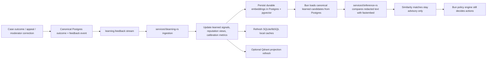

# Humanify learning and calibration

Purpose: define the implementation-facing learning pipeline, learned-signal ownership, embedding lifecycle, calibration rules, and suppression safeguards for moderator-confirmed outcomes.

Governing docs:
- `AGENTS.md`
- `Implementation Plan.txt`
- `docs\README.md`
- `docs\reference-baseline.md`
- `docs\contracts.md`
- `docs\data-platform.md`
- `docs\observability-security.md`
- `docs\architecture.md`
- `docs\cases-and-reports.md`
- `docs\learning.md`

Upstream docs:
- pgvector: https://github.com/pgvector/pgvector/blob/master/README.md
- SQLite: https://www.sqlite.org/docs.html
- libSQL: https://docs.turso.tech/libsql
- sqlite-vec: https://alexgarcia.xyz/sqlite-vec/
- Qdrant: https://qdrant.tech/documentation/
- fastembed-rs: https://docs.rs/fastembed/latest/fastembed/
- Candle: https://huggingface.github.io/candle/
- ort: https://ort.pyke.io/
- Burn: https://burn.dev/books/burn/

## 1. Learning role

Learning improves future scoring from moderator-confirmed outcomes while preserving the safety model.

1. moderator-confirmed outcomes and appeals are the canonical labels
2. learned signals affect score, confidence, and reason codes
3. learned signals never directly authorize Discord moderation actions
4. false positives reduce weight, confidence, or future applicability
5. every learned signal remains traceable to source cases and evidence references

## 2. Pipeline overview

## 3. Canonical inputs and outputs

| Input | Owner | Why it matters |
| --- | --- | --- |
| `case_outcomes` | Postgres | authoritative label for scam/bot/hacked-account/false-positive/dismissed/overturned |
| `appeals` and appeal events | Postgres | tells learning when prior decisions were wrong or recovered |
| `reports` and `case_events` | Postgres | context for calibration, reporter reputation, and evidence quality |
| `signal_examples` | Postgres | durable trace from outcome to pattern example |
| `learned_signals` | Postgres | reusable pattern metadata and suppression state |
| `signal_embeddings` | Postgres + `pgvector` | durable vector ownership and freshness |
| local SQLite/libSQL caches | worker-local | acceleration only; rebuildable |

## 4. Learned-signal families

| Family | Example source | Typical effect |
| --- | --- | --- |
| text similarity | confirmed scam templates, repeated phishing scripts | raises score and reason-code confidence |
| domain reputation | repeated malicious domains or lookalikes | raises score, may trigger verification/quarantine |
| invite reputation | invite codes used by suspicious joins | raises join-time risk |
| image or perceptual hash | repeated scam screenshots or attachments | adds evidence linkage |
| behavior pattern | repeated mention bursts, timing patterns, raid signatures | boosts behavioral risk |
| reporter reputation | reporter accuracy over time | weights future report credibility |
| false-positive suppression | overturned or dismissed patterns | reduces or nullifies previously noisy signals |

## 5. Storage and freshness rules

1. Durable embeddings live in Postgres-backed `signal_embeddings` first.
2. SQLite/libSQL + `sqlite-vec` stores worker-local copies for cheap nearest-neighbor checks.
3. Optional Qdrant remains projection-only until `pgvector` proves insufficient.
4. Learned signals should track freshness, decay, disable/suppress flags, and the last moderator-confirmed source case.
5. Deletion or retention changes start from the owning Postgres entity and project outward.
6. The first real slice records `signal_examples.source_outcome_id` so every reinforcement or suppression stays attributable to the exact moderator-confirmed outcome that changed the signal.

## 6. Calibration and suppression rules

| Situation | Required response |
| --- | --- |
| repeated true positives | increase confidence within documented bounds |
| repeated false positives | reduce weight, mark noisy, or disable signal |
| appeal overturns | create a suppression or correction event and recalculate related reputation |
| stale signals | decay confidence or expire the signal |
| provider-driven or one-off noise | keep as case-local evidence instead of promoting to reusable learned signal |

Metrics that should eventually be materialized for review:

- true-positive rate
- false-positive rate
- appeal overturn rate
- verification pass rate
- quarantine precision
- reason-code usefulness

## 7. Service responsibilities

| Component | Responsibility |
| --- | --- |
| `services\learning-rs` | ingest feedback, recompute signal weights, maintain suppressions, publish projection refreshes |
| `services\inference-rs` | consume Bun-supplied learned candidates, embed text with `fastembed-rs`, and surface advisory similarity/rerank results |
| `packages\policy-engine` | decide how advisory score changes affect allowed actions |
| dashboard review surfaces | expose calibration and suppression state to moderators/operators |

### 7.1 Concrete first advisory path

The first production-quality slice is:

1. Bun reads canonical `learned_signals` / `signal_embeddings` ownership metadata from Postgres-backed state.
2. Bun sends redacted `messageText` plus `learnedSignalCandidates` into `services\inference-rs`.
3. `services\inference-rs` uses `fastembed-rs` for `/embed`, `/similarity`, `/rerank`, and for optional similarity boosts inside `/score` / `/classify/text`.
4. Image classification remains explicit-capability-only until a real image backend is wired.

### 7.2 Concrete first moderator-confirmed learning slice

The first real learning/calibration path is now:

1. `POST /guilds/:guildId/cases/:caseId/review` persists canonical `case_events`, `case_outcomes`, `audit_records`, `idempotency_receipts`, and `outbox_events`, and updates the case summary status in Postgres.
2. The API hashes the subject user ID, sends the canonical `CaseOutcome` payload to `services\learning-rs`, and treats the Rust response as advisory calibration input only.
3. Bun persists reusable learned text candidates into `learned_signals`, `signal_examples`, and `signal_embeddings` using redacted evidence previews or report context.
4. `signal_embeddings` rows are created with `pending_projection` metadata until a later projection worker computes durable vectors; Humanify does not claim that moderators retrained a model.
5. `false_positive`, `dismissed`, and `overturned` outcomes lower matching signal weight/confidence and may flip `is_suppressed` / `suppressed_at` according to the documented suppression rules.
6. The same moderator-confirmed outcome now refreshes canonical `reputation_views` for `reporter_reputation`, so later queue and anomaly reads can weight trusted reporters explicitly without crossing the Bun authority boundary.
7. `POST /guilds/:guildId/reports` also refreshes canonical `subject_report_anomaly` summaries from report velocity and repeated-trigger counts; those summaries are advisory-only risk enrichment for `GET /guilds/:guildId/risk-queue`.
8. If `services\learning-rs` is unavailable, the moderator-confirmed outcome still persists canonically and the `learning.feedback` outbox event remains the honest retry path.

## 8. Safety invariants

1. Learning is explainability-preserving: every promoted signal must point back to source cases or evidence references.
2. Learning is privacy-minimizing: prefer hashes, embeddings, and normalized metadata over raw private content.
3. Learning is reviewable: moderators need a way to see and eventually disable bad signals.
4. Learning is advisory: a learned match may raise risk, but Bun policy still decides verification, quarantine, timeout, kick, or ban.

## 9. Follow-on work unlocked by this doc

- `services\learning-rs` expansion beyond scaffold endpoints
- Postgres tables for `learned_signals`, `signal_examples`, `signal_embeddings`, and calibration views
- worker-local cache schema for SQLite/libSQL + `sqlite-vec`
- dashboard calibration and trust surfaces tied to real moderator outcomes
