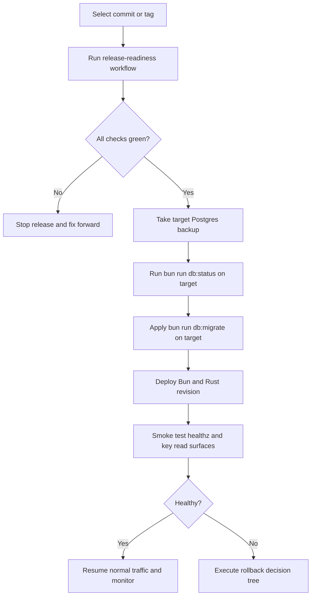

# Humanify release and rollback runbooks

Purpose: define the concrete CI-backed release-readiness, migration, rollout, rollback, and post-release operating steps that the repository can honestly support today.

Governing docs:
- `AGENTS.md`
- `Implementation Plan.txt`
- `docs\architecture.md`
- `docs\operations.md`
- `docs\observability-security.md`
- `docs\testing.md`
- `docs\workspaces.md`

Upstream docs:
- GitHub Actions workflow syntax: https://docs.github.com/en/actions/reference/workflows-and-actions/workflow-syntax
- GitHub Actions artifacts: https://docs.github.com/en/actions/how-tos/writing-workflows/choosing-what-your-workflow-does/storing-and-sharing-data-from-a-workflow
- Bun CI guide: https://bun.sh/guides/runtime/cicd
- `setup-bun` action: https://github.com/oven-sh/setup-bun
- Rust toolchain action: https://github.com/actions-rust-lang/setup-rust-toolchain
- Cargo test: https://doc.rust-lang.org/cargo/commands/cargo-test.html
- pgvector Docker image: https://hub.docker.com/r/pgvector/pgvector

## 1. What is real today

Humanify now has two real GitHub Actions workflows:

| Workflow | Trigger | What it does |
| --- | --- | --- |
| `.github\workflows\ci.yml` | pushes to `main`, pull requests | runs Bun validation/build, Rust tests + formatting, and canonical migration validation against a clean `pgvector/pgvector:pg17` database |
| `.github\workflows\release-readiness.yml` | manual dispatch, `v*` tags | reruns the validation bundle, builds the dashboard/verifier assets and Rust release binaries, and uploads a release-readiness artifact bundle |

What this backbone **does not** do yet:

- no automated deploy
- no automated database backup
- no automatic GitHub Release publishing
- no secret or environment provisioning

That is intentional. The repo can validate, build, and package evidence for a release candidate, but it does not pretend to own a deployment target that is not yet defined.

## 2. Release order and safety contract



This order preserves the Humanify invariants:

1. canonical Postgres safety first
2. explicit migration step before feature activation
3. rollout and rollback decisions happen against canonical state, not queue or cache state
4. release automation stops before deployment instead of faking the final mile

## 3. CI runbook

Use `.github\workflows\ci.yml` as the required pre-merge gate.

Current jobs:

| Job | Commands |
| --- | --- |
| Bun workspace validation | `bun install --frozen-lockfile`, `bun run check`, `bun run build` |
| Rust workspace validation | `bun install --frozen-lockfile`, `bun run format:check`, `cargo test --workspace --all-targets` |
| Postgres migration validation | `bun install --frozen-lockfile`, `bun run db:migrate`, `bun run db:migrate`, `bun run db:status` |

Failure handling:

- if Bun validation fails, treat the ref as not releasable
- if Rust validation fails, do not ship even if Bun checks are green
- if migration validation fails, treat it as a canonical-data blocker and stop the release path immediately

## 4. Release-readiness runbook

Use `.github\workflows\release-readiness.yml` when you want a candidate bundle for manual promotion.

Trigger it in one of two ways:

1. push a `v*` tag
2. run the workflow manually with `workflow_dispatch`

The workflow produces one artifact bundle containing:

- `artifacts/release-readiness/summary.md`
- `docs\release-runbooks.md`
- `packages\db\migrations\*.sql`
- `apps\dashboard-start\dist`
- `apps\verifier-start\dist`
- `target\release\evidence-rs`
- `target\release\inference-rs`
- `target\release\learning-rs`
- `target\release\trust-rs`

Use that bundle as release evidence, not as an implicit deploy.

## 5. Manual migration and rollout runbook

Until a concrete deploy target exists, operators should use the following target-agnostic sequence.

### 5.1 Preflight

1. pick the exact commit or tag that already passed `release-readiness`
2. ensure target environment variables are injected explicitly (`HUMANIFY_DATABASE_URL` or the `HUMANIFY_POSTGRES_*` set)
3. confirm a fresh Postgres backup exists
4. confirm Redis/Electric/read-model lag is understood before touching traffic

### 5.2 Migration

Run these commands against the target Postgres instance:

```bash
bun install --frozen-lockfile
bun run db:status
bun run db:migrate
bun run db:status
```

Rules:

- never skip `db:status` before the migration
- if `db:status` reports drift, stop and investigate before rollout
- if `db:migrate` fails, do not start a partial app rollout

### 5.3 Application rollout

After migrations succeed:

1. deploy the Bun/API/bot and Rust service revision that passed release-readiness
2. smoke test `apps\api-bun` plus each Rust service `healthz` endpoint
3. verify dashboard and verifier read surfaces still render honest boundary states
4. only then resume or unpause any traffic shaping, callbacks, or consumer activity you deliberately paused

## 6. Rollback runbook

Rollback choices depend on whether canonical schema changed.

### 6.1 Checks failed before migration

- do not deploy
- fix forward and rerun `release-readiness`

### 6.2 Migration not applied, app rollout failed

- redeploy the last known good Bun/Rust revision
- keep Postgres unchanged

### 6.3 Migration applied, app rollout failed

Use this decision order:

1. determine whether the new migration is backward-compatible with the previous app revision
2. if it is backward-compatible, redeploy the last known good app revision
3. if it is **not** backward-compatible, do **not** improvise SQL reversals against canonical tables; keep the schema, pause the rollout, and fix forward with a patched revision

Never treat Redis Streams, Electric projections, or local SQLite caches as rollback truth. They are rebuildable layers; Postgres remains canonical.

## 7. Incident mini-runbooks

### 7.1 Migration drift detected

1. stop the rollout
2. inspect `schema_migrations`
3. compare the checked-in SQL checksum against the applied checksum
4. fix the mismatch with an explicit follow-up migration or operational repair plan; do not mutate the checked-in historical migration silently

### 7.2 Release bundle green, smoke tests red

1. keep rollout paused
2. inspect API and Rust service logs first
3. verify database connectivity and migration state
4. decide rollback vs fix-forward using section 6

### 7.3 Post-release queue or projection issues

1. confirm Postgres canonical writes are healthy
2. inspect Redis pending entries / consumer health
3. inspect Electric lag separately from canonical write health
4. replay or rebuild only from canonical Postgres-backed state
