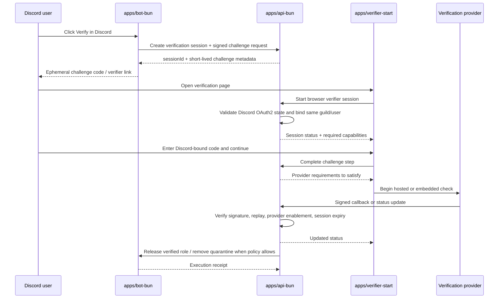

# Humanify verification system

Purpose: define the implementation-facing verification session lifecycle, Discord-bound challenge flow, provider abstraction, callback rules, and release-to-role semantics for the Bun-owned verification subsystem.

Governing docs:
- `AGENTS.md`
- `Implementation Plan.txt`
- `docs\README.md`
- `docs\reference-baseline.md`
- `docs\contracts.md`
- `docs\data-platform.md`
- `docs\observability-security.md`
- `docs\architecture.md`
- `docs\api.md`
- `docs\discord-bot.md`
- `docs\verification.md`

Upstream docs:
- Discord OAuth2: https://discord.com/developers/docs/topics/oauth2
- Discord interactions security: https://discord.com/developers/docs/interactions/receiving-and-responding#security-and-authorization
- Cloudflare R2 presigned URLs: https://developers.cloudflare.com/r2/api/s3/presigned-urls/
- PostgreSQL: https://www.postgresql.org/docs/current/index.html
- Redis Streams: https://redis.io/docs/latest/develop/data-types/streams/
- OpenTelemetry context propagation: https://opentelemetry.io/docs/concepts/context-propagation/

## 1. Verification subsystem scope

Verification exists to reduce uncertainty and safely release legitimate users. It owns:

1. pending verification session creation
2. Discord-bound one-time challenge generation
3. browser session binding through Discord OAuth2
4. provider requirement orchestration
5. server-side callback verification and replay protection
6. final release-to-role or quarantine-release decision
7. durable audit and artifact metadata

It does **not** grant moderation authority to providers or clients. Providers return attestations; Bun decides whether the guild's configured requirement is satisfied.

## 2. Session model

| Entity | Purpose | Canonical owner |
| --- | --- | --- |
| `verification_sessions` | user+guild scoped verification attempt and current state | Postgres |
| `verification_requirements` | guild-configured capabilities and fallback rules | Postgres |
| `verification_artifacts` | redacted provider result metadata and attestation refs | Postgres |
| short-lived challenge secret | Discord-bound one-time proof | derived server secret + Postgres metadata |
| provider callback receipt | replay-safe callback record | Postgres idempotency + audit |

Recommended session states:

`pending` → `challenge_issued` → `oauth_bound` → `provider_pending` → `passed` or `failed` or `expired` or `cancelled`

`released` is a terminal post-pass state once the bot actually applies the verification role release or quarantine removal.

## 3. Verification flow

## 4. Provider abstraction

The product plan's provider-capability abstraction should be implemented as Bun-owned orchestration around provider adapters.

| Capability | Meaning | Example policy use |
| --- | --- | --- |
| `captcha` | low-assurance bot resistance | default first-line challenge |
| `human_presence` | presence of a live human | stronger fallback before quarantine release |
| `unique_person` | uniqueness proof without full identity | communities that want Sybil resistance |
| `age_over_18` | threshold age claim | age-gated communities |
| `liveness` | real-time anti-spoof human check | higher-trust recovery or appeal paths |
| `document_identity` | full identity/ID workflow | only when explicitly enabled by server policy |
| `device_risk` | environment risk or abuse signal | optional strengthening signal |

Implementation rule: the provider adapter returns normalized attestation results; guild policy maps those capabilities to allow/deny/review behavior.

## 4.1 Current implemented verifier spine

The first real verifier path now makes these boundaries concrete without inventing unsupported provider semantics:

1. `POST /guilds/:guildId/verification/sessions` issues a signed verifier challenge token that carries `sessionId`, `challengeId`, `guildId`, `userId`, and required capabilities.
2. `GET /verification/sessions/:sessionId?token=...` verifies that signed token and derives the initial `challenge_issued` session view honestly from Bun-owned state, even before canonical persistence exists.
3. `POST /verification/challenges/:challengeId/complete` re-verifies the same signed token against `challengeId`, `sessionId`, `guildId`, and `userId` before returning `provider_pending`.
4. Provider callbacks remain disabled until a concrete provider doc and signature contract exist, so release stays blocked instead of pretending a provider passed.
5. The verifier app now forwards `x-request-id` and W3C `traceparent` on its session fetch and challenge-complete requests so verification troubleshooting lines up with the same correlation model as Bun and Rust services.

This means the verifier app currently relies on a Bun-authored signed link rather than a user-entered Discord short code or completed OAuth account binding. Those richer steps remain explicit follow-on work and must not be faked client-side.

## 5. Route and callback responsibilities

| Boundary | Representative route | Required invariant |
| --- | --- | --- |
| Session start | `POST /guilds/:guildId/verification/sessions` | create canonical session before sending challenge |
| Session fetch | `GET /verification/sessions/:sessionId` | expose only guild/user-authorized state |
| Challenge completion | `POST /verification/challenges/:challengeId/complete` | same Discord user, same guild, short-lived single-use challenge |
| Provider status/callback | `POST /callbacks/providers/:providerId` | signature verification, replay-safe receipt, provider enabled for guild |
| Release decision | `POST /verification/sessions/:sessionId/release` | Bun evaluates policy, bot executes role change, audit row written |

## 6. Security and privacy invariants

1. OAuth2 binds the browser user to the Discord user who initiated the verification request.
2. One-time challenges are short-lived, single-use, and scoped to `guildId`, `userId`, and the initiating interaction/session.
3. Provider success reported by the browser is never sufficient; the backend must verify the provider callback or token server-side.
4. Only minimum provider artifact metadata is stored durably; raw payloads and secrets are not synced to clients.
5. Failed, expired, duplicate, or tampered callbacks create auditable reject records.
6. Release-to-role happens only after the session reaches a Bun-validated `passed` state and current guild policy still allows release.

## 7. How verification interacts with moderation

- verification lowers uncertainty and may downgrade risk, but it does not erase prior evidence or case history
- a passed verification can trigger role release, reduced risk score, or case review recommendations depending on policy
- a failed or expired verification can keep quarantine, escalate to review, or preserve current containment
- irreversible actions still require the normal policy engine and moderator review path where configured

## 8. Dependencies for later phases

- `packages\auth` must implement Discord OAuth2 authorize URL building, signed state/CSRF handling, verifier challenge tokens, and session cookie helpers to match this document
- bot challenge delivery and release receipts must match `docs\discord-bot.md`
- API callback and release routes must match `docs\api.md`
- provider-specific docs should be added here before the first real provider integration lands
