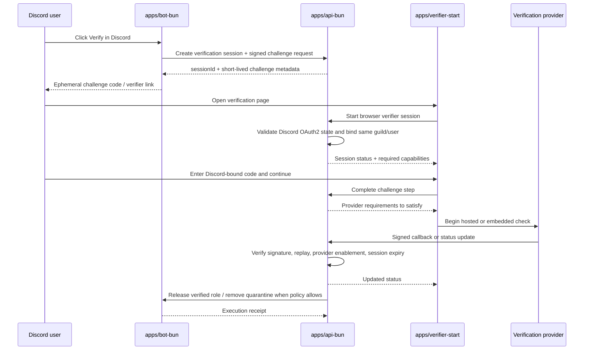

# Humanify verification system

Purpose: define the implementation-facing verification session lifecycle, Discord-bound challenge flow, provider abstraction, callback rules, and release-to-role semantics for the Bun-owned verification subsystem.

Governing docs:
- `AGENTS.md`
- `Implementation Plan.txt`
- `docs\README.md`
- `docs\reference-baseline.md`
- `docs\contracts.md`
- `docs\data-platform.md`
- `docs\observability-security.md`
- `docs\architecture.md`
- `docs\api.md`
- `docs\discord-bot.md`
- `docs\verification.md`

Upstream docs:
- Discord OAuth2: https://discord.com/developers/docs/topics/oauth2
- Discord interactions security: https://discord.com/developers/docs/interactions/receiving-and-responding#security-and-authorization
- Self Protocol docs: https://docs.self.xyz/
- World ID concepts: https://docs.world.org/world-id/concepts
- Didit API flow: https://docs.didit.me/integration/api-full-flow
- Didit webhooks: https://docs.didit.me/integration/webhooks
- Didit retention/deletion: https://docs.didit.me/console/data-retention
- W3C VC Data Model: https://www.w3.org/TR/vc-data-model/
- Semaphore nullifiers: https://semaphore.appliedzkp.org/docs/concepts/nullifiers
- Cloudflare R2 presigned URLs: https://developers.cloudflare.com/r2/api/s3/presigned-urls/
- PostgreSQL: https://www.postgresql.org/docs/current/index.html
- Redis Streams: https://redis.io/docs/latest/develop/data-types/streams/
- OpenTelemetry context propagation: https://opentelemetry.io/docs/concepts/context-propagation/

## 1. Verification subsystem scope

Verification exists to reduce uncertainty and safely release legitimate users. It owns:

1. pending verification session creation
2. Discord-bound one-time challenge generation
3. browser session binding through Discord OAuth2
4. provider requirement orchestration
5. server-side callback verification and replay protection
6. final release-to-role or quarantine-release decision
7. durable audit and artifact metadata

It does **not** grant moderation authority to providers or clients. Providers return attestations; Bun decides whether the guild's configured requirement is satisfied.

## 2. Session model

| Entity | Purpose | Canonical owner |
| --- | --- | --- |
| `verification_sessions` | user+guild scoped verification attempt and current state | Postgres |
| `verification_requirements` | guild-configured capabilities and fallback rules | Postgres |
| `verification_artifacts` | redacted provider result metadata and attestation refs | Postgres |
| short-lived challenge secret | Discord-bound one-time proof | derived server secret + Postgres metadata |
| provider callback receipt | replay-safe callback record | Postgres idempotency + audit |

Recommended session states:

`pending` → `challenge_issued` → `oauth_bound` → `provider_pending` → `passed` or `failed` or `expired` or `cancelled`

`released` is a terminal post-pass state once the bot actually applies the verification role release or quarantine removal.

## 3. Verification flow

## 4. Provider abstraction

The product plan's provider-capability abstraction should be implemented as Bun-owned orchestration around provider adapters.

| Capability | Meaning | Example policy use |
| --- | --- | --- |
| `captcha` | low-assurance bot resistance | default first-line challenge |
| `human_presence` | presence of a live human | stronger fallback before quarantine release |
| `unique_person` | uniqueness proof without full identity | communities that want Sybil resistance |
| `age_over_18` | threshold age claim | age-gated communities |
| `liveness` | real-time anti-spoof human check | higher-trust recovery or appeal paths |
| `document_identity` | full identity/ID workflow | only when explicitly enabled by server policy |
| `device_risk` | environment risk or abuse signal | optional strengthening signal |

Implementation rule: the provider adapter returns normalized attestation results; guild policy maps those capabilities to allow/deny/review behavior.

### Shared provider template and registry

Provider-specific code now belongs in `packages\verification-providers`, not in `apps\api-bun` or `apps\verifier-start`.

That package owns:

1. the generic provider template (`defineVerificationProvider(...)`)
2. the registered provider catalog
3. the default Humanify ID bundle and supported claim keys
4. runtime filtering of enabled providers

Every provider definition must declare:

| Field group | Required shape | Why it exists |
| --- | --- | --- |
| identity | `id`, `title`, `defaultRank` | stable registry identity and default ordering |
| user-facing manifest | `summary`, `goodFor`, `whatYouNeed`, `benefits`, `thingsToKnow` | lets the verifier UI explain tradeoffs in plain language without provider-specific conditionals |
| privacy contract | `privacySummary`, `privacyDetails`, optional `deletionPolicy` | keeps storage/deletion rules attached to the provider module itself |
| server handoff contract | `integration.handoffKind`, `integration.serverEndpointPath`, `integration.serverVerificationNote` | makes the API/verifier talk about a generic server verification handoff instead of baking in provider-specific routes |
| supported predicates | `supportedClaimKeys` | keeps Humanify ID claim compatibility near the provider module |

The API and verifier must consume the shared catalog only. They must not switch on provider ids or titles in app-level code.

### Runtime and guild enablement

- `HUMANIFY_ENABLED_VERIFICATION_PROVIDERS` controls which providers the Bun API can expose at all.
- `VITE_HUMANIFY_ENABLED_VERIFICATION_PROVIDERS` controls which providers the verifier UI can show at all.
- `PUT /guilds/:guildId/verification` then lets each server owner choose which of those available providers are enabled for that guild and which one is the default.
- Keep the environment-level allowlist aligned so the browser never offers a provider the API has disabled globally.

### Adding or removing providers

1. Add or update a provider module under `packages\verification-providers\src\providers\`.
2. Register it in the shared provider catalog.
3. Update this document with the provider's official upstream references and storage/deletion rules.
4. Enable or disable it at runtime with the environment variables above.

That keeps the main apps open for extension and closed for modification: the catalog changes, while verifier/API orchestration stays provider-neutral.

## 4.1 Provider choice at verification time

Humanify should let the user choose the verification path **during verification**, with the verifier UI explaining both privacy and coverage tradeoffs in user language:

| Provider | Best use | Privacy profile | Practical limitation |
| --- | --- | --- | --- |
| `self` / Self.xyz | best default for `age_over_18` + `nationality` with selective disclosure | strongest privacy; open-source ZK proofs and user-held credentials | requires supported biometric/NFC documents or attestations |
| `world_id` / World ID | proof-of-personhood / `unique_person` lane where supported | very strong privacy with nullifiers and ZK proofs | country and credential coverage is narrower, so it is not the broadest age/nationality path |
| `didit` / Didit | fast browser fallback with broad ID coverage | lowest privacy of the three because the provider processes identity data | Humanify must actively purge the provider session after normalizing the result |

Important implementation rule: **Self.xyz is the privacy-first default**, **World ID is the uniqueness-oriented option**, and **Didit is the speed/coverage fallback**.

The server owner controls which of these choices are actually available in their guild. The verifier UI should only render the enabled subset and clearly mark the guild default without hiding the other enabled options.

### Provider-specific guidance

1. **Self.xyz**
   - best fit for the first reusable Humanify ID because it supports selective disclosure for age and nationality
   - Humanify should verify proofs and store only proof receipts / nullifiers / issuer references, not the underlying document data
2. **World ID**
   - best fit for proof-of-human / uniqueness, especially where unlinkable nullifiers matter
   - should remain advisory and optional until document/credential coverage for the target user base is acceptable
3. **Didit**
   - useful when the user needs the fastest web flow or broader document support
   - privacy limitation must be shown to the user explicitly: the provider processes the document data to create the verification result
   - Humanify should follow a **process-and-purge** model:
     - receive the normalized result
     - store only the minimum attestation needed for policy and audit
     - call Didit's delete-session API (`DELETE /v3/session/{session_id}/`) immediately after normalization

## 4.2 Humanify ID: reusable selective-disclosure identity

Humanify ID should be a **user-held reusable credential**, not a server-side identity warehouse.

For the first implementation, the default bundle should be:

- `age_over_18`
- `nationality`

`unique_person` should remain a later extension, most naturally backed by World ID or another proof-of-personhood source.

### Storage model

Humanify should not store:

- raw document images
- passport or national ID numbers
- date of birth
- the full provider payload
- the full reusable credential payload

Humanify should store only:

- proof receipt metadata
- issuer/provider reference
- claim predicates that were satisfied
- expiry / freshness metadata
- unlinkable or scope-limited nullifiers / replay guards
- audit references showing that Bun verified the proof

This matches the W3C VC model's privacy and data-minimization guidance while keeping reusable proofs with the user, not the server.

## 4.3 Current implemented verifier spine

The first real verifier path now makes these boundaries concrete without inventing unsupported provider semantics:

1. `POST /guilds/:guildId/verification/sessions` issues a signed verifier challenge token that carries `sessionId`, `challengeId`, `guildId`, `userId`, and required capabilities.
2. `GET /verification/sessions/:sessionId?token=...` verifies that signed token and derives the initial `challenge_issued` session view honestly from Bun-owned state, even before canonical persistence exists.
3. The verifier UI now renders the shared provider catalog from `packages\verification-providers`, so provider descriptions, deletion policies, and server handoff notes come from provider modules rather than app-local conditionals.
4. `POST /verification/challenges/:challengeId/complete` re-verifies the same signed token against `challengeId`, `sessionId`, `guildId`, and `userId`, validates the selected provider against the shared registry, and carries the chosen provider plus the requested Humanify ID claim predicates (`age_over_18`, `nationality`) through a provider-neutral server handoff boundary.
5. Provider handoffs remain disabled until a concrete provider doc and signature/proof contract exist, so release stays blocked instead of pretending a provider passed.
6. The verifier app now forwards `x-request-id` and W3C `traceparent` on its session fetch and challenge-complete requests so verification troubleshooting lines up with the same correlation model as Bun and Rust services.

This means the verifier app currently relies on a Bun-authored signed link rather than a user-entered Discord short code or completed OAuth account binding. Those richer steps remain explicit follow-on work and must not be faked client-side.

## 5. Route and callback responsibilities

| Boundary | Representative route | Required invariant |
| --- | --- | --- |
| Session start | `POST /guilds/:guildId/verification/sessions` | create canonical session before sending challenge |
| Session fetch | `GET /verification/sessions/:sessionId` | expose only guild/user-authorized state |
| Challenge completion | `POST /verification/challenges/:challengeId/complete` | same Discord user, same guild, short-lived single-use challenge |
| Provider status/callback | `POST /callbacks/providers/:providerId` | signature verification, replay-safe receipt, provider enabled for guild |
| Release decision | `POST /verification/sessions/:sessionId/release` | Bun evaluates policy, bot executes role change, audit row written |

## 6. Security and privacy invariants

1. OAuth2 binds the browser user to the Discord user who initiated the verification request.
2. One-time challenges are short-lived, single-use, and scoped to `guildId`, `userId`, and the initiating interaction/session.
3. Provider success reported by the browser is never sufficient; the backend must verify the provider callback or token server-side.
4. Only minimum provider artifact metadata is stored durably; raw payloads and secrets are not synced to clients.
5. Failed, expired, duplicate, or tampered callbacks create auditable reject records.
6. Release-to-role happens only after the session reaches a Bun-validated `passed` state and current guild policy still allows release.

## 7. How verification interacts with moderation

- verification lowers uncertainty and may downgrade risk, but it does not erase prior evidence or case history
- a passed verification can trigger role release, reduced risk score, or case review recommendations depending on policy
- a failed or expired verification can keep quarantine, escalate to review, or preserve current containment
- irreversible actions still require the normal policy engine and moderator review path where configured

## 8. Dependencies for later phases

- `packages\auth` must implement Discord OAuth2 authorize URL building, signed state/CSRF handling, verifier challenge tokens, and session cookie helpers to match this document
- bot challenge delivery and release receipts must match `docs\discord-bot.md`
- API callback and release routes must match `docs\api.md`
- provider-specific docs should be added here before the first real provider integration lands
