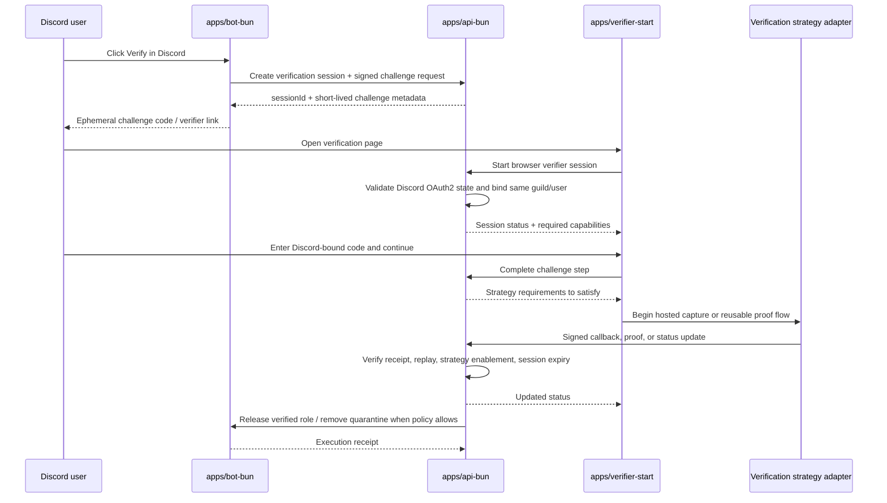
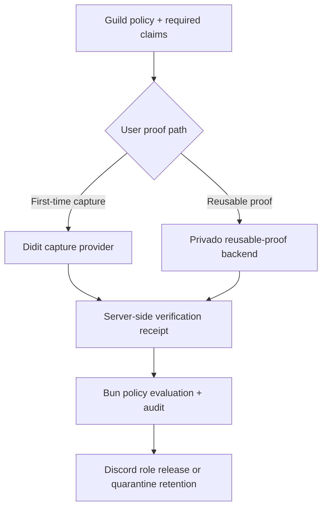
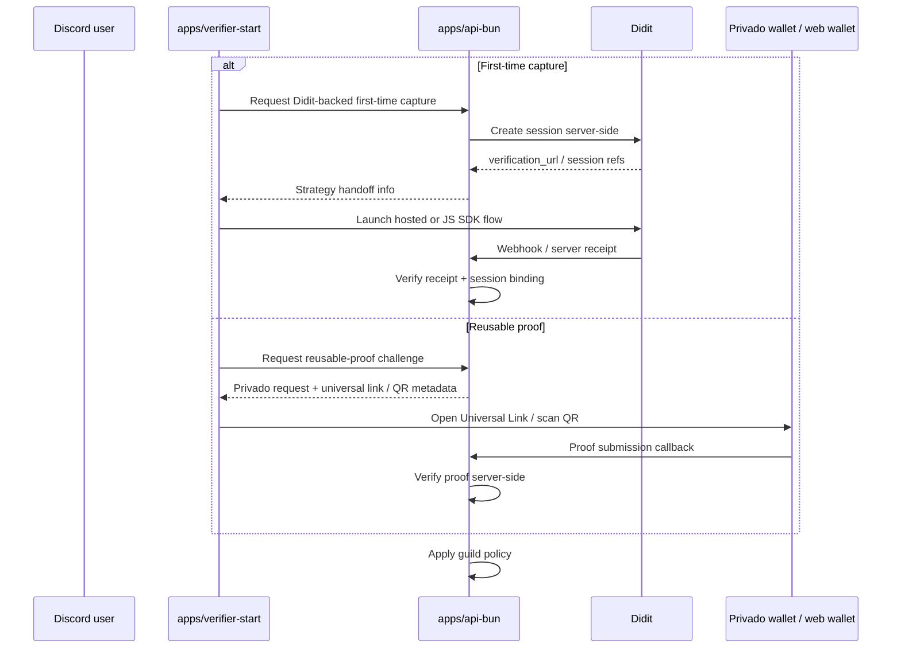

# Humanify verification system

Purpose: define the implementation-facing verification session lifecycle, Discord-bound challenge flow, capture-flow and reusable-proof abstraction, callback rules, and release-to-role semantics for the Bun-owned verification subsystem.

Governing docs:
- `AGENTS.md`
- `Implementation Plan.txt`
- `docs\README.md`
- `docs\reference-baseline.md`
- `docs\contracts.md`
- `docs\data-platform.md`
- `docs\observability-security.md`
- `docs\architecture.md`
- `docs\api.md`
- `docs\discord-bot.md`
- `docs\verification.md`

Upstream docs:
- Discord OAuth2: https://discord.com/developers/docs/topics/oauth2
- Discord interactions security: https://discord.com/developers/docs/interactions/receiving-and-responding#security-and-authorization
- Didit JavaScript SDK: https://docs.didit.me/integration/web-sdks/javascript-sdk
- Didit API flow: https://docs.didit.me/integration/api-full-flow
- Didit webhooks: https://docs.didit.me/integration/webhooks
- Didit reusable KYC overview: https://docs.didit.me/core-technology/reusable-kyc/overview
- Didit share KYC via API: https://docs.didit.me/core-technology/reusable-kyc/share-kyc-via-api
- Privado verifier overview: https://docs.privado.id/docs/verifier/verifier-overview/
- Privado request API: https://docs.privado.id/docs/verifier/verification-library/request-api/
- Privado universal links: https://docs.privado.id/docs/wallet/universal-links/
- Privado verification API: https://docs.privado.id/docs/verifier/verification-library/verification-api/
- Privado verifier backend: https://docs.privado.id/docs/verifier/verifier-backend/
- World ID concepts: https://docs.world.org/world-id/concepts
- W3C VC Data Model: https://www.w3.org/TR/vc-data-model/
- Semaphore nullifiers: https://semaphore.appliedzkp.org/docs/concepts/nullifiers
- Cloudflare R2 presigned URLs: https://developers.cloudflare.com/r2/api/s3/presigned-urls/
- PostgreSQL: https://www.postgresql.org/docs/current/index.html
- Redis Streams: https://redis.io/docs/latest/develop/data-types/streams/
- OpenTelemetry context propagation: https://opentelemetry.io/docs/concepts/context-propagation/

## 1. Verification subsystem scope

Verification exists to reduce uncertainty and safely release legitimate users. It owns:

1. pending verification session creation
2. Discord-bound one-time challenge generation
3. browser session binding through Discord OAuth2
4. strategy requirement orchestration
5. server-side receipt verification and replay protection
6. final release-to-role or quarantine-release decision
7. durable audit and artifact metadata

It does **not** grant moderation authority to strategy adapters or clients. Adapters return attestations; Bun decides whether the guild's configured requirement is satisfied.

## 2. Session model

| Entity | Purpose | Canonical owner |
| --- | --- | --- |
| `verification_sessions` | user+guild scoped verification attempt and current state | Postgres |
| `verification_requirements` | guild-configured capabilities and fallback rules | Postgres |
| `verification_artifacts` | redacted strategy result metadata and attestation refs | Postgres |
| short-lived challenge secret | Discord-bound one-time proof | derived server secret + Postgres metadata |
| strategy handoff receipt | replay-safe server receipt record | Postgres idempotency + audit |

Recommended session states:

`pending` → `challenge_issued` → `oauth_bound` → `strategy_pending` → `passed` or `failed` or `expired` or `cancelled`

`released` is a terminal post-pass state once the bot actually applies the verification role release or quarantine removal.

Verification metadata also records whether face verification was part of the capture flow and whether the face check passed. Guild policy can depend on those normalized fields; Bun does not infer them later from raw provider payloads.

## 3. Verification flow

## 4. Verification role and strategy model

Humanify keeps verification architecture generic by splitting concrete adapters into strategy roles instead of baking provider brands into app logic.

| Strategy role | What the adapter does | Humanify responsibility | Default / primary concrete adapter | Explicit non-goal |
| --- | --- | --- | --- | --- |
| capture provider | runs a first-time capture flow and returns an attested session result | create the Bun-owned session, bind the Discord challenge, receive the server receipt, normalize the result, and apply policy | **Didit** is the default first-time capture provider | importing a third-party full KYC session into Humanify as a storage shortcut |
| reusable proof backend | requests reusable proofs from user-held credentials or wallet state and verifies them off-chain | create the verifier request, present proof options, require server-side verification, and store only proof receipts | **Privado** is the primary reusable-proof backend | treating browser completion as proof or storing the full credential payload |
| policy consumer / strategy pipeline | evaluates normalized outcomes against guild policy and controls role release | Bun API + verifier + bot own challenge binding, policy evaluation, audit, and release decisions | **Humanify** | custodying identity documents or becoming the canonical identity wallet |

Implementation rule: `packages\verification-providers` remains the shared adapter registry, but Bun policy, persistence, and UI language are defined in terms of **role + claim predicates + server verification contract**, not provider-specific app branches. On disk, one-time capture flows and reusable proof backends live in separate folders and separate manifests because a first-time capture flow is not a reusable provider.

### 4.1 Shared strategy registry and runtime enablement

Role-specific verification code belongs in `packages\verification-providers`, not in `apps\api-bun` or `apps\verifier-start`.

Folder rule:

- one-time capture flows live under a dedicated capture-flow folder
- reusable proof backends live under a provider or reusable-backend folder
- policy-consumer wiring lives in its own shared strategy/pipeline layer
- Didit does not live in the reusable provider folder because it is a first-time capture flow

That package owns:

1. the generic strategy templates
2. the registered capture-flow catalog
3. the registered reusable-proof-backend catalog
4. the registered strategy pipeline catalog
5. the supported claim keys for each concrete adapter
6. runtime filtering of enabled adapters

Every adapter definition must declare:

| Field group | Required shape | Why it exists |
| --- | --- | --- |
| role + identity | `role`, `id`, `title`, `defaultRank` | keeps concrete adapters registered under a generic strategy model |
| user-facing manifest | `summary`, `goodFor`, `whatYouNeed`, `benefits`, `thingsToKnow` | lets the verifier explain tradeoffs without app-local provider conditionals |
| privacy contract | `privacySummary`, `privacyDetails`, optional `deletionPolicy` | keeps retention and minimization rules attached to the adapter |
| server handoff contract | `integration.handoffKind`, `integration.serverEndpointPath`, `integration.serverVerificationNote` | keeps the Bun boundary generic while still supporting concrete adapters |
| supported predicates | `supportedClaimKeys` | ties user-facing proof bundles to reusable policy checks |

The API and verifier must consume the shared catalog only. They may carry a concrete adapter id through routes and config, but they must not hard-code provider semantics in app-level control flow.

Runtime and guild enablement stay Bun-owned:

- `HUMANIFY_ENABLED_VERIFICATION_PROVIDERS` controls which concrete adapters the Bun API can expose at all.
- `VITE_HUMANIFY_ENABLED_VERIFICATION_PROVIDERS` controls which concrete adapters the verifier UI can render at all.
- `PUT /guilds/:guildId/verification` lets each server owner choose which adapters are enabled and which first-time capture adapter is the guild default.
- Keep the environment allowlists aligned so the browser never offers an adapter the API has disabled globally.

### 4.2 First-time capture default: Didit

Didit is the **default first-time capture provider** for flows that need a fresh browser-based identity or liveness capture.

Per Didit's official docs, the intended integration shape is:

1. Bun creates the verification session server-side with Didit's API using a workflow id and callback URL.
2. Bun returns the resulting `verification_url` (or equivalent session URL) to the verifier.
3. The verifier launches that URL in Didit's web flow, including the JavaScript SDK when Humanify wants an embedded or modal browser experience.
4. Didit sends a webhook/status update that Bun verifies server-side before Humanify marks the session as passed.

Important consequences for Humanify:

- browser completion is only a UX signal; it is **never** enough to release a user
- Bun must verify the Didit webhook or equivalent server-side receipt before changing canonical verification state
- Humanify stores only normalized verification facts needed for policy and audit, not the full Didit session payload
- those normalized facts include whether face verification ran and whether the face check passed

Didit also documents reusable KYC and B2B session sharing. Humanify **does not** use Didit's B2B full-session import as an internal shortcut. Didit's own sharing docs state that the import flow creates a **complete copy of the verification session, including documents and checks, inside the receiving service's environment**. That is out of bounds for Humanify because:

1. Humanify is a verifier/orchestrator/policy consumer, not an identity-data custodian
2. importing full Didit sessions would collapse the architecture back into provider-baked storage
3. reusable-proof reuse belongs in the reusable backend role, not the capture-provider role

### 4.3 Reusable-proof default: Privado

Privado is the **primary reusable-ID / reusable-proof backend** for Humanify's reusable verification lane.

Privado's verifier docs establish the intended model:

1. the verifier creates an off-chain auth or query request describing the claims that must be proven
2. Humanify presents that request through a Universal Link or QR code so the user can open Privado's wallet or web wallet
3. the wallet generates the proof and sends it back to the verifier callback
4. Bun verifies the proof server-side, either directly with the verification library flow or through a Privado verifier backend deployment

This makes Privado the correct home for later reusable-proof verification in Humanify:

- the user keeps the underlying credential and wallet state
- Humanify asks only for the minimum proof bundle needed by guild policy
- Bun records the verification receipt, trusted issuer scope, freshness, and satisfied predicates
- Humanify does not store the full credential payload or identity document data

### 4.4 Consumer-facing proof choices

The verifier should present verification as **proof choices**, not provider brands. Concrete adapters remain visible for transparency, but the primary user decision is which proof path to use.

| User-facing path | Strategy role | Default / primary adapter | Typical claims |
| --- | --- | --- | --- |
| Verify for the first time | capture provider | Didit | `age_over_18`, `nationality`, `document_identity`, `liveness` |
| Use a reusable proof | reusable proof backend | Privado | `age_over_18`, `nationality`, later other reusable predicates |
| Prove uniqueness only | reusable proof backend or later specialist backend | later extension | `unique_person` |

At verification time, the verifier presents these consumer-facing proof bundles:

| Verifier choice | Claims carried | Best for |
| --- | --- | --- |
| Only prove age over 18 | `age_over_18` | age-gated communities that do not need nationality |
| Only prove nationality | `nationality` | communities that only need country or citizenship eligibility |
| Prove age + nationality | `age_over_18`, `nationality` | communities that need both checks or users who want one reusable combined proof |

For the first implementation, the default proof bundle remains:

- `age_over_18`
- `nationality`

`unique_person` remains a later extension and must stay behind the same role-based strategy model rather than becoming new app-local branching logic.

### 4.5 Minimal-storage rule

Humanify is a verifier/orchestrator/policy consumer only. It does **not** custody identity information.

Humanify does not store:

- raw document images
- passport or national ID numbers
- date of birth
- the full capture-provider payload
- the full reusable credential payload
- imported third-party full-session copies

Humanify stores only:

- proof receipt metadata
- issuer/provider reference
- claim predicates that were satisfied
- normalized face-verification fields (`faceVerificationPerformed`, `faceVerificationPassed`) when the capture flow exposes them
- expiry / freshness metadata
- unlinkable or scope-limited nullifiers / replay guards
- strategy handoff identifiers needed for audit and idempotency
- audit references showing that Bun verified the proof server-side

This matches the W3C VC model's minimization guidance while keeping raw identity data out of Humanify's custody.

### 4.6 Reference strategy flows

### 4.7 Current verifier spine and remaining gaps

The current verifier spine is intentionally generic, but the default Didit capture flow is now wired through a real Bun-owned session spine:

1. `POST /guilds/:guildId/verification/sessions` creates the canonical verification session, stores the short-lived challenge boundary, and returns the signed verifier challenge token that carries `sessionId`, `challengeId`, `guildId`, `userId`, and required capabilities.
2. `GET /verification/sessions/:sessionId?token=...` verifies that signed token and returns the canonical persisted session when available, while still refusing to invent provider success from browser state alone.
3. The verifier UI renders the shared adapter catalog from `packages\verification-providers`, so strategy descriptions, privacy notes, and server handoff notes come from adapter modules rather than app-local conditionals.
4. The verifier UI lets the person verifying choose both the proof bundle and the concrete adapter, using consumer-facing wording rather than operator language.
5. `POST /verification/challenges/:challengeId/complete` re-verifies the same signed token against `challengeId`, `sessionId`, `guildId`, and `userId`, validates the selected adapter against the shared registry, and:
   - creates a real Didit session server-side when the selected adapter is `didit`
   - returns the Didit SDK launch contract to the verifier shell
   - exposes reusable-proof adapters through the same shared boundary with `providerStartEndpoint` and a signed `providerStartToken`
6. `POST /callbacks/providers/didit` verifies the raw-body HMAC/timestamp webhook boundary, fetches the authoritative Didit decision server-side, reduces the result to minimal-custody facts, and requests Didit-side deletion after reconciliation.
7. `POST /verification/sessions/:sessionId/providers/:providerId/start` is the reusable-proof start boundary. Today it is implemented for Privado and must:
   - verify the signed start token
   - build the provider request from Humanify claim predicates
   - return only wallet launch metadata (`request`, `requestUri`, `universalLink`, QR value) plus a signed `providerSessionToken`
8. `POST /verification/providers/:providerId/proof` is the reusable-proof verification boundary. Today it is implemented for Privado and must:
   - verify the signed provider session token
   - call the Privado verifier backend `GET /status`
   - normalize the result down to satisfied predicates, nullifiers scoped to the Humanify session, trusted issuer scopes, and minimal proof receipt refs or hashes
   - keep release blocked until Bun's canonical session state and policy checks agree
9. The verifier app forwards `x-request-id` and W3C `traceparent` on its session fetch, challenge-complete, reusable-proof start, and reusable-proof verification requests so troubleshooting lines up with the same correlation model as Bun and Rust services.

This means the verifier app currently relies on a Bun-authored signed link rather than a user-entered Discord short code or completed OAuth account binding. Those richer steps remain explicit follow-on work and must not be faked client-side.

## 5. Route and callback responsibilities

| Boundary | Representative route | Required invariant |
| --- | --- | --- |
| Session start | `POST /guilds/:guildId/verification/sessions` | create canonical session before sending challenge |
| Session fetch | `GET /verification/sessions/:sessionId` | expose only guild/user-authorized state |
| Challenge completion | `POST /verification/challenges/:challengeId/complete` | same Discord user, same guild, short-lived single-use challenge |
| Reusable-proof request start | `POST /verification/sessions/:sessionId/providers/:providerId/start` | signed provider-start token, provider-enabled config, no browser-created proof requests |
| Reusable-proof status verification | `POST /verification/providers/:providerId/proof` | signed provider-session token, server-side status read, minimal normalized proof evidence only |
| Strategy handoff receipt | `POST /callbacks/providers/:providerId` | verify the concrete adapter's server receipt, enforce replay safety, and require the adapter to be enabled for the guild |
| Release decision | `POST /verification/sessions/:sessionId/release` | Bun evaluates policy, bot executes role change, audit row written |

## 6. Security and privacy invariants

1. OAuth2 binds the browser user to the Discord user who initiated the verification request.
2. One-time challenges are short-lived, single-use, and scoped to `guildId`, `userId`, and the initiating interaction/session.
3. Browser-reported success is never sufficient; Bun must verify the provider callback, proof submission, or equivalent server receipt before passing the session.
4. Only minimum strategy artifact metadata is stored durably; raw payloads, reusable credentials, full imported sessions, and secrets are not synced to clients.
5. Failed, expired, duplicate, or tampered callbacks create auditable reject records.
6. Release-to-role happens only after the session reaches a Bun-validated `passed` state and current guild policy still allows release.

## 6.1 Privado runtime configuration

Reusable-proof start and verification stay disabled unless Bun has explicit Privado verifier config:

- `HUMANIFY_PRIVADO_VERIFIER_BASE_URL` — base URL for the Privado verifier backend deployment Humanify calls for `/sign-in` and `/status`
- `HUMANIFY_PRIVADO_ALLOWED_ISSUERS` — comma-separated trusted issuer DIDs; wildcard issuers are intentionally rejected
- `HUMANIFY_PRIVADO_CHAIN_ID` — optional chain id passed into the generated Privado request payload

When those variables are absent, Humanify may still render Privado in shared catalogs for future capability planning, but Bun must not create or verify reusable proofs for it.

## 7. How verification interacts with moderation

- verification lowers uncertainty and may downgrade risk, but it does not erase prior evidence or case history
- a passed verification can trigger role release, reduced risk score, or case review recommendations depending on policy
- a failed or expired verification can keep quarantine, escalate to review, or preserve current containment
- irreversible actions still require the normal policy engine and moderator review path where configured

## 8. Dependencies for later phases

- `packages\auth` must implement Discord OAuth2 authorize URL building, signed state/CSRF handling, verifier challenge tokens, and session cookie helpers to match this document
- bot challenge delivery and release receipts must match `docs\discord-bot.md`
- API callback and release routes must match `docs\api.md`
- release policy, role changes, and Discord-side execution still need to move from the current blocked placeholder to a canonical post-verification release flow
